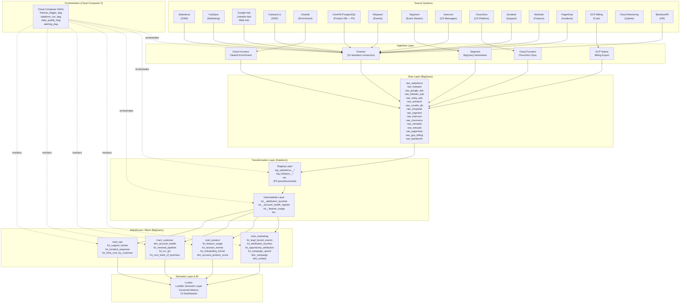

# Pipeline Architecture
## Release: 02-data-foundation
## Core Dynamics Data Platform Modernisation

**Client**: Core Dynamics, Inc.
**Release**: 02-data-foundation
**Prepared by**: Wire Autopilot (Kofi Asante, Sophie Tanner — Rittman Analytics)
**Date**: 2026-03-24
**Version**: 1.0

---

## 1. Architecture Overview

The Core Dynamics data platform uses a modern ELT (Extract-Load-Transform) architecture on Google Cloud. Raw data is extracted from 18 source systems and loaded into BigQuery via Fivetran (standard connectors) and custom Cloud Functions. Transformation occurs within BigQuery using Dataform's three-layer model. Cloud Composer 2 (Airflow) orchestrates the full pipeline from extraction through to warehouse and quality validation.

**Architecture Pattern**: ELT — transform in the warehouse, not before loading.
**Design Principle**: Separate concerns — raw layer is append-only and never modified by transformation; staging layer is 1:1 with source tables; business logic lives in intermediate and warehouse layers.

---

## 2. Source System Analysis

| Source | Technology | Schema Complexity | Volume (est.) | Sensitivity | Replication Method | Rationale |
|--------|-----------|------------------|---------------|------------|-------------------|-----------|
| Salesforce | Cloud SaaS | High (200+ objects, nested) | ~50K accounts, ~500K contacts | Medium (business data) | Fivetran Standard Connector (incremental) | Native Fivetran connector with change data capture; most reliable for complex Salesforce schema |
| HubSpot | Cloud SaaS | High (contacts, companies, engagements) | ~200K contacts | Medium (contact emails) | Fivetran Standard Connector (incremental) | Native connector; incremental sync via HubSpot updated_at timestamps |
| Google Ads | Cloud SaaS | Medium (campaigns, ad groups, ads) | ~10K rows/day | Low | Fivetran Standard Connector (daily full refresh for small tables, incremental for performance) | Native connector; daily refresh sufficient for marketing reporting cadence |
| LinkedIn Ads | Cloud SaaS | Medium | ~2K rows/day | Low | Fivetran Standard Connector (daily) | Native connector |
| Meta Ads | Cloud SaaS | Medium | ~3K rows/day | Low | Fivetran Standard Connector (daily) | Native connector |
| Outreach.io | Cloud SaaS | Medium (sequences, touches) | ~50K touches/month | Low | Fivetran Standard Connector (6-hour) | Native connector with incremental updates |
| Clearbit | REST API | Low (firmographic enrichment) | On-demand (~100 calls/day) | Low | Cloud Function (webhook-triggered) | No native Fivetran connector for on-demand enrichment; webhook trigger from HubSpot |
| CoreFM PostgreSQL | PostgreSQL (on GCP, read-only replica) | High (30+ tables, PII) | ~5M rows, growing; high write volume | **High** (PII: user emails, names) | Fivetran CDC Connector (near real-time, 15 min) via Cloud SQL Auth Proxy | CDC required for near-real-time product usage data; read-only replica protects operational DB |
| Mixpanel | Cloud SaaS | Medium (event stream) | ~1M events/day | Medium | Fivetran Standard Connector (daily) | Native connector; daily batch sufficient; deduplication with Segment handled at staging layer |
| Segment | Event stream | Medium (event stream) | ~1M events/day | Medium | Segment BigQuery Destination (streaming) | Native BigQuery destination; streaming to BigQuery; dedup with Mixpanel at staging |
| Intercom | Cloud SaaS | Low (conversations, surveys) | ~5K conversations/month | Low | Fivetran Standard Connector (6-hour) | Native connector |
| ChurnZero | SaaS (custom API) | Low (health scores, NPS, segments) | ~5K records/day | Low | **Custom Cloud Function** (incremental, daily) | No native Fivetran connector; REST API with incremental sync by updated_at |
| Zendesk | Cloud SaaS | Medium (tickets, agents, SLA policies) | ~2K tickets/month | Low | Fivetran Standard Connector (1-hour) | Native connector; 1-hour sync for intraday SLA tracking requirement |
| NetSuite | Cloud SaaS | High (complex financial schema) | ~10K records/day | Low | Fivetran Standard Connector (daily) | Native connector; integration role required — start provisioning immediately |
| PagerDuty | Cloud SaaS | Low (incidents, on-call) | ~200 incidents/month | Low | Fivetran Standard Connector (1-hour) | Native connector |
| GCP Billing | Native BigQuery export | Low (cost records) | ~500 rows/day | Low | Native BigQuery Export (already enabled, to be formalised) | Native export is simplest and most reliable; T+1 latency acceptable |
| Cloud Monitoring | GCP API | Low (uptime metrics) | ~1K metrics/day | Low | Dataform scheduled query (Cloud Monitoring API → BigQuery) | Cloud Monitoring API queryable directly; lightweight scheduled query sufficient |
| BambooHR | Cloud SaaS | Low (employees, departments) | ~500 employees | Low | Fivetran Standard Connector (daily) | Native connector; daily refresh sufficient for headcount data |

**Data gaps identified vs. conceptual model:**
- GCP Billing label coverage for per-customer cost attribution is unknown — Sean Murphy to provide audit before DO-02 scoping.
- Salesforce `Renewal_Date__c` is null/incorrect for ~15% of pre-2023 accounts — documented; client-owned remediation.

---

## 3. Replication Strategy

### Strategy Definitions

| Strategy | Used For | Implementation |
|----------|---------|----------------|
| **Incremental (CDC)** | CoreFM PostgreSQL | Fivetran CDC connector captures row-level changes within 15 minutes |
| **Incremental (updated_at)** | Salesforce, HubSpot, Outreach, Intercom, Zendesk, PagerDuty, NetSuite, BambooHR | Fivetran incremental sync based on updated_at timestamp; Fivetran manages watermarks |
| **Daily full refresh (small)** | Google Ads, LinkedIn Ads, Meta Ads, Mixpanel | Full refresh daily for small tables; acceptable since ad data can be revised retroactively |
| **Streaming** | Segment | Segment BigQuery Destination streams events directly; near-real-time |
| **On-demand webhook** | Clearbit | Cloud Function triggered by HubSpot new lead webhook; async enrichment |
| **Custom incremental** | ChurnZero | Cloud Function with incremental sync via updated_at filter; daily batch |
| **Native export** | GCP Billing | Daily BigQuery export at T+1; no custom logic required |

### Design Decision: Fivetran over Custom Connectors
**Decision**: Use Fivetran standard connectors for all 15 applicable sources. Build custom Cloud Functions only for ChurnZero (no Fivetran connector) and Clearbit (on-demand webhook pattern).
**Rationale**: Fivetran manages schema evolution, error retry, and incremental watermarks automatically. Custom connectors introduce maintenance burden. The two custom connectors (ChurnZero, Clearbit) are necessary because Fivetran does not offer native solutions.

### Design Decision: CDC for CoreFM PostgreSQL
**Decision**: Use Fivetran CDC (log-based replication) rather than query-based incremental sync.
**Rationale**: The CoreFM production PostgreSQL is a high-write-volume operational database. Query-based incremental sync would require polling queries that add load to the operational database. CDC via log replication is non-invasive and captures all changes including deletes. The read-only replica further protects the operational DB.

---

## 4. Pipeline Architecture Specification

### 4.1 Layer Architecture

```
Raw Layer (raw_<source>)
├── append-only landing zone
├── Fivetran-managed schema (not modified by RA code)
├── Includes Fivetran metadata columns (_fivetran_synced, _fivetran_deleted)
└── One dataset per source (16 raw datasets)

Staging Layer (staging dataset)
├── 1:1 with source tables (one staging model per source table)
├── Column-level documentation and type casting
├── Surrogate key generation (SHA256-based on natural key)
├── PII pseudonymisation (CoreFM PostgreSQL user tables)
├── Field renaming to snake_case
├── Source deduplication (Segment vs. Mixpanel per event mapping)
└── Materialization: view (default) or table for large sources

Intermediate Layer (intermediate dataset)
├── Cross-source joins and business logic
├── Shared dimensions (dim_date, dim_account master)
├── Attribution touch assembly (marketing)
├── Feature usage aggregation foundation (product)
└── Materialization: ephemeral (for logic encapsulation) or view

Warehouse/Marts Layer
├── mart_marketing: fct_lead_funnel_events, fct_campaign_spend, fct_attribution_touches, fct_opportunity_attribution, dim_campaign, dim_contact
├── mart_product: fct_feature_usage, fct_session_events, fct_onboarding_funnel, dim_account_product_score, fct_workflow_completion
├── mart_customer: dim_account_health, fct_renewal_pipeline, fct_expansion_signals, fct_csm_book_of_business, fct_nrr_grr, fct_churn_events
├── mart_ops: fct_support_tickets, fct_incident_response, fct_infra_cost_by_customer, fct_support_capacity
└── Materialization: table (all warehouse models; partitioned on date columns)
```

### 4.2 Naming Conventions

| Layer | Convention | Example |
|-------|-----------|---------|
| Raw datasets | `raw_<source_system>` | `raw_salesforce` |
| Staging models | `stg_<source_system>__<entity>` | `stg_salesforce__accounts` |
| Intermediate models | `int__<entity>` or `int__<entity>__<description>` | `int__attribution_touches`, `int__account__health_signals` |
| Fact tables | `<entity>_fct` | `fct_lead_funnel_events` |
| Dimension tables | `<entity>_dim` | `dim_campaign` |
| Surrogate keys | `<entity>_pk` | `account_pk` |
| Foreign keys | `<referenced_entity>_fk` | `account_fk` |

### 4.3 Scheduling

| Source / Layer | Schedule | Tool |
|---------------|---------|------|
| Salesforce, HubSpot, Outreach, Intercom, Zendesk, PagerDuty | Every 6h / 1h per source | Fivetran |
| Google Ads, LinkedIn Ads, Meta Ads, Mixpanel | Daily (3–4am UTC) | Fivetran |
| NetSuite, BambooHR | Daily (5am UTC) | Fivetran |
| CoreFM PostgreSQL (CDC) | Near real-time (15 min) | Fivetran |
| Segment | Streaming (continuous) | Segment BigQuery Destination |
| ChurnZero | Daily (6am UTC) | Cloud Function (Cloud Scheduler trigger) |
| GCP Billing | Daily (T+1, ~2am UTC) | Native BigQuery export |
| Cloud Monitoring | Daily (7am UTC) | Dataform scheduled query |
| Dataform staging + intermediate + warehouse | Daily (8am UTC, after all overnight syncs complete) | Cloud Composer |
| Dataform intraday (high-priority sources) | Every 2 hours for Zendesk, Salesforce | Cloud Composer |

### 4.4 Error Handling

| Failure Type | Response | Alert |
|-------------|---------|-------|
| Fivetran connector sync failure | Fivetran auto-retry (3 attempts); after 3 failures, alert | Fivetran email notification + Slack via alerting_dag |
| Cloud Function execution failure | Cloud Function retry (exponential backoff, 3 attempts); Dead Letter Topic in Pub/Sub | Cloud Logging alert → Slack |
| Dataform model compilation error | Pipeline fails; downstream models blocked | Cloud Composer alert_dag → Slack + email |
| Dataform assertion failure | Pipeline fails at assertion step; warehouse not updated | Cloud Composer alert_dag → Slack + email |
| Cloud Composer DAG failure | DAG marked failed; retry configured per DAG | Airflow email + Slack alert |

---

## 5. Data Flow Diagram



---

## 6. Technology Stack

| Component | Technology | Version | Notes |
|-----------|-----------|---------|-------|
| Data Warehouse | BigQuery | Standard edition | Partitioned + clustered tables for warehouse layer |
| Transformation | Dataform | Latest (GitHub-connected) | Three-layer model; CI/CD via GitHub Actions |
| Pipelines | Fivetran | Business Critical | Core Dynamics to procure; 15 standard connectors |
| Custom pipelines | Cloud Functions Gen 2 | Python 3.11 | ChurnZero + Clearbit only |
| Orchestration | Cloud Composer 2 | Airflow 2.x | dev + prod environments |
| Streaming | Segment BigQuery Destination | Segment-managed | Real-time event streaming |
| Secret Management | GCP Secret Manager | Latest | All credentials; no secrets in code |
| Source Control | GitHub | Core Dynamics org | PR review workflow before prod promotion |
| Alerting | Cloud Monitoring + Slack | Slack webhook | Pipeline failure notifications |
| BI (pipeline health) | Looker | Core Dynamics instance | Pipeline health dashboard only in this release |

---

## 7. Security & Governance

### Data Classification
| Classification | Sources | Handling |
|---------------|---------|---------|
| High Sensitivity (PII) | CoreFM PostgreSQL (user emails, names), BambooHR (employee data) | Pseudonymised at staging layer; only account_id / pseudonymised employee_id in downstream models |
| Medium Sensitivity | HubSpot (contact emails), Salesforce (contact data), Segment/Mixpanel (user events) | Access restricted to data-engineers role; not exposed in Looker without specific field controls |
| Low Sensitivity | Ad platforms, Zendesk (ticket data), NetSuite (financial), GCP Billing | Standard access controls |

### Access Controls
- No production credentials in code (all in GCP Secret Manager)
- Fivetran service account has read-only access to each source system
- Dataform service account has read from raw layer, write to staging/intermediate/warehouse
- Looker service account has read from warehouse layer only
- CoreFM PostgreSQL: read-only service account; access via Cloud SQL Auth Proxy within GCP VPC

### PII Pseudonymisation (CoreFM PostgreSQL)
- `user_id` hashed using SHA-256 with a salt stored in GCP Secret Manager
- `user_email`, `user_name` fields dropped (not landed in BigQuery)
- `account_id` retained as the join key to Salesforce
- Pseudonymisation approach documented in technical note; requires sign-off from Priya Nair + Diane Hooper before implementation

---

## 8. Design Decisions

| Decision | Choice | Rationale |
|----------|--------|----------|
| ELT vs ETL | ELT (transform in BigQuery) | BigQuery's compute is cheap and scalable; Fivetran loads raw data with no transformation; preserves full source fidelity |
| Fivetran vs custom connectors | Fivetran for 15/18 sources | Fivetran handles schema evolution, retries, and incremental watermarks; custom connectors only where no alternative exists |
| CDC for CoreFM PostgreSQL | Fivetran CDC (log-based) | Non-invasive; captures deletes; required for 15-minute freshness target; read-only replica protects operational DB |
| Dataform over dbt | Dataform | Client is Google Cloud-native; Dataform integrates with BigQuery, Cloud Composer, and GitHub without additional infrastructure; aligns with SOW specification |
| Three-layer model | staging → intermediate → warehouse | Industry standard; staging provides raw-faithful models; intermediate encapsulates cross-source business logic; warehouse is mart-ready |
| Daily full refresh for ad platforms | Daily full refresh | Ad platforms allow retroactive data changes (conversion attribution updates); incremental sync would miss these; volume is low enough that daily full refresh is efficient |
| Secret Manager for all credentials | GCP Secret Manager | Centralised, audited, version-controlled secrets; no credentials in code or environment variables |
