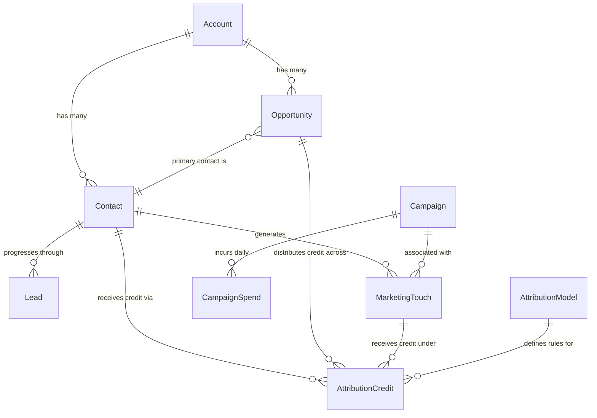

# Conceptual Model
## Release: 03-marketing-analytics
## Core Dynamics Data Platform Modernisation

**Client**: Core Dynamics, Inc.
**Prepared by**: Sophie Tanner, Rittman Analytics
**Date**: 2026-03-24
**Version**: 1.0

---

## 1. Overview

This conceptual model defines the core business entities for the Marketing Analytics workstream. It covers the multi-touch attribution pipeline from first marketing touch to closed-won revenue — spanning lead lifecycle, campaign spend, contact engagement, and opportunity attribution.

All entities sit within the `mart_marketing` BigQuery dataset. The model builds on staging layers from the 02-data-foundation release.

---

## 2. Entity Definitions

### Contact
A person who has engaged with Core Dynamics marketing or been created in HubSpot or Salesforce.

**Key attributes**:
- Unique identifier (pseudonymised email hash as secondary key)
- HubSpot lifecycle stage (subscriber → lead → MQL → SAL → SQL)
- Salesforce contact linkage
- Firmographic enrichment (Clearbit — industry, company size, country)
- Account association

**Approximate volume**: ~200,000 contacts in HubSpot; ~30,000 matched to Salesforce

---

### Account
A company that is either a prospect, customer, or former customer of Core Dynamics.

**Key attributes**:
- Salesforce account ID
- Company name, industry, employee count range
- ARR (Annual Recurring Revenue)
- Account tier / segment (Enterprise, Mid-Market, SMB)

**Approximate volume**: ~5,000 prospects + 312 customers

---

### Lead
A specific Contact's progression through the Core Dynamics demand generation funnel — one record per Contact per funnel stage transition.

**Key attributes**:
- Contact reference
- Account reference
- Funnel stage (Subscriber, Lead, MQL, SAL, SQL)
- Stage entered timestamp
- Stage exited timestamp
- Days in stage
- Conversion flag
- Originating channel

**Approximate volume**: ~200,000 contacts × ~5 stages = ~1M stage transition events

---

### MarketingTouch
A single trackable interaction between a Contact and Core Dynamics marketing content or SDR outreach, within the attribution window.

**Key attributes**:
- Contact reference
- Touch timestamp
- Touch type (page_view, form_submit, email_open, email_click, outreach_email, outreach_call, ad_click)
- Channel (paid_search, paid_social, content, email, sdr, organic, unattributed)
- Campaign reference
- Asset reference (content asset or landing page)

**Approximate volume**: ~5M–10M touch events across HubSpot + Outreach history

---

### Campaign
A named marketing initiative run across one or more channels with defined goals, budget, and date range.

**Key attributes**:
- Campaign name
- Channel (paid_search, paid_social, content, events, sdr_sequence, webinar)
- Campaign type
- Target segment
- Start / end dates
- Total budget (USD)
- Active flag

**Approximate volume**: ~500–1,000 campaigns across all sources

---

### CampaignSpend
Daily advertising expenditure for a Campaign at the ad group level, from paid digital platforms.

**Key attributes**:
- Spend date
- Channel (google_ads, linkedin_ads, meta_ads)
- Campaign reference
- Ad group / creative name
- Impressions, clicks, spend (USD)
- CTR, CPC

**Approximate volume**: ~3 platforms × ~365 days × ~100 campaigns = ~100K rows/year

---

### Opportunity
A sales opportunity in Salesforce representing potential revenue from an Account.

**Key attributes**:
- Salesforce opportunity ID
- Account reference
- Primary contact reference
- Opportunity stage (Qualification → Discovery → Demo → Proposal → Negotiation → Closed Won / Closed Lost)
- Close date
- ARR value
- Pipeline value
- Created date
- Marketing-sourced flag
- Marketing-influenced flag

**Approximate volume**: ~3,000–5,000 opportunities (active + historical)

---

### AttributionCredit
The allocation of Opportunity revenue value to a specific MarketingTouch under a given Attribution Model.

**Key attributes**:
- Opportunity reference
- Touch reference
- Attribution model (first_touch, last_touch, linear, time_decay, u_shaped)
- Attributed revenue (USD)
- Attributed pipeline (USD)
- Touch rank in journey
- Days before opportunity creation

**Approximate volume**: ~5,000 opps × ~20 touches avg × 5 models = ~500K rows

---

### AttributionModel
A named rule set for distributing Opportunity revenue credit across MarketingTouches in a contact journey.

**Key attributes**:
- Model name (first_touch, last_touch, linear, time_decay, u_shaped)
- Description
- Default model flag (u_shaped = true)

**Approximate volume**: 5 rows (static reference)

---

## 3. Entity Relationships

---

## 4. Relationship Narratives

**Account → Contact** (one to many):
An Account has many Contacts. Some Contacts may not yet be matched to an Account (especially HubSpot-only contacts not yet in Salesforce). Fuzzy matching resolves ~88% of contacts to an Account; ~12% remain unmatched and are attributed without account linkage.

**Account → Opportunity** (one to many):
An Account has many Opportunities over its lifetime (new business, expansion, renewal). Each Opportunity links to exactly one Account. A Contact may be associated with multiple Opportunities but attribution is tracked at the Contact-Opportunity level.

**Contact → Lead** (one to many):
A Contact progresses through the Core Dynamics funnel, generating one Lead record per stage transition. The Lead entity captures the time spent at each stage and conversion events — enabling funnel velocity analysis and stage conversion rates.

**Contact → MarketingTouch** (one to many):
A Contact generates many MarketingTouches over their lifecycle. Touches span HubSpot engagements (page views, form submissions, email interactions) and Outreach SDR activity (calls, emails). Only touches within the 180-day window preceding Opportunity creation are included in attribution calculations.

**Campaign → CampaignSpend** (one to many):
A Campaign generates daily CampaignSpend records at the ad group level from paid platforms (Google Ads, LinkedIn Ads, Meta Ads). Non-paid campaigns (content, SDR sequences, webinars) may have zero CampaignSpend records.

**Campaign → MarketingTouch** (one to many):
A Campaign is associated with many MarketingTouches via UTM parameters or HubSpot campaign membership. Approximately 30% of touches cannot be linked to a Campaign due to missing UTMs — these are tagged "unattributed" rather than dropped.

**Opportunity → AttributionCredit** (one to many):
Each Opportunity distributes its revenue/pipeline value across all MarketingTouches in the 180-day window, generating one AttributionCredit row per touch per attribution model. The sum of AttributionCredit.attributed_revenue_usd for a given Opportunity and model equals the Opportunity's closed-won ARR.

**MarketingTouch → AttributionCredit** (one to many):
A single MarketingTouch may receive AttributionCredit under multiple Attribution Models. The credit amount varies by model; under first-touch, the first touch gets 100%, while under linear, every touch gets an equal share.

**AttributionModel → AttributionCredit** (one to many):
Each of the five Attribution Models defines the rules for distributing credit. The AttributionModel entity is a reference table; AttributionCredit records are the output of applying those rules to Opportunity-Touch pairs.

---

## 5. Out-of-Scope Entities

The following entities are relevant to marketing analytics but are explicitly out of scope for this release:

| Entity | Why Out of Scope | Future Release |
|--------|-----------------|---------------|
| CustomerLifetimeValue | Requires customer retention data and renewal history | Release 05: customer-analytics |
| PredictedChurnProbability | BQML model in customer analytics workstream | Release 05: customer-analytics |
| ProductEngagementScore | Requires CoreFM product usage data | Release 04: product-analytics |
| NPS / CXSatisfaction | Customer success data; not a marketing metric | Release 05: customer-analytics |
| NetSuiteRevenue | Financial revenue reconciliation | Release 06: operational-analytics |

---

## 6. Open Questions

| # | Question | Impact | Owner |
|---|----------|--------|-------|
| OQ-1 | **SAL stage as HubSpot lifecycle stage vs. custom property** — determines extraction approach in staging | fct_lead_funnel_events grain | Niamh Collins |
| OQ-2 | **HubSpot stage timestamps** — native fields or audit log reconstruction needed? | Lead entity timestamp accuracy | Niamh Collins |
| OQ-3 | **Outreach contact identifier** — email or Outreach-specific ID used for HubSpot join? | MarketingTouch-Contact match rate | Kofi Asante |
| OQ-4 | **U-shaped lead conversion event** — SAL or MQL when both exist in journey? | AttributionCredit calculation for u_shaped model | Rachel Summers |
