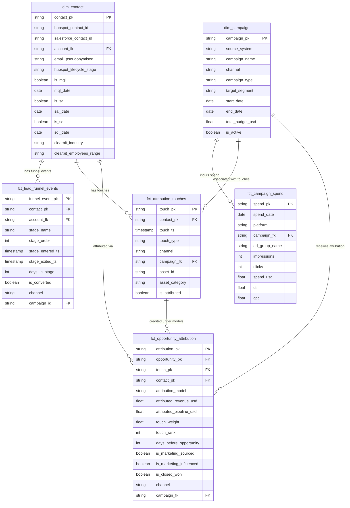

# Data Model Specification
## Release: 03-marketing-analytics
## Core Dynamics Data Platform Modernisation

**Client**: Core Dynamics, Inc.
**Prepared by**: Sophie Tanner, Rittman Analytics
**Date**: 2026-03-24
**Version**: 1.0

---

## 1. Overview

This document specifies the complete dbt model design for the marketing analytics workstream. All models live in the `mart_marketing` BigQuery dataset. The transformation pipeline has three layers:

1. **Staging** — already deployed (02-data-foundation); used via `source()` references
2. **Intermediate** — new cross-system joins and attribution prep logic (5 models)
3. **Warehouse** — consumer-facing facts and dimensions (6 models)

All email fields are stored as SHA-256 hashes only. No plain-text PII in any warehouse model.

---

## 2. Source Definitions

```yaml
# sources.yml (marketing subpackage)
sources:
  - name: staging
    database: core-dynamics-analytics-prod
    schema: staging
    freshness:
      warn_after: {count: 8, period: hour}
      error_after: {count: 12, period: hour}
    loaded_at_field: _fivetran_synced
    tables:
      - name: stg_salesforce__contacts
      - name: stg_salesforce__opportunities
      - name: stg_salesforce__campaigns
      - name: stg_salesforce__accounts
      - name: stg_hubspot__contacts
      - name: stg_hubspot__form_submissions
      - name: stg_hubspot__email_sends
      - name: stg_hubspot__page_views
      - name: stg_google_ads__campaigns
      - name: stg_google_ads__ad_groups
      - name: stg_linkedin_ads__campaigns
      - name: stg_linkedin_ads__creatives
      - name: stg_meta_ads__campaigns
      - name: stg_meta_ads__ad_sets
      - name: stg_outreach__mailings
      - name: stg_outreach__calls

  - name: raw_hubspot
    database: core-dynamics-analytics-prod
    schema: raw_hubspot
    tables:
      - name: clearbit_enrichment
```

---

## 3. Intermediate Models

All intermediate models materialise as views in the `intermediate` dataset.

### 3.1 `int__contacts__unified`

**Purpose**: Unified contact master across HubSpot and Salesforce, with fuzzy match for the ~12% mismatch, email pseudonymisation, and Clearbit enrichment join.

**Grain**: One row per unique contact (HubSpot contact ID as primary source; Salesforce contact ID joined)

**Key columns**:

| Column | Type | Description |
|--------|------|-------------|
| contact_pk | STRING | Surrogate key: SHA-256(lower(trim(email))) |
| hubspot_contact_id | STRING | HubSpot native contact ID |
| salesforce_contact_id | STRING | Salesforce contact ID (NULL if unmatched) |
| account_fk | STRING | Salesforce account_pk (NULL if unmatched or no account) |
| email_hash | STRING | SHA-256 of lowercased, trimmed email — PII-safe identifier |
| company_domain | STRING | Email domain extracted for fuzzy match fallback |
| first_name | STRING | From HubSpot (preferred) or Salesforce |
| last_name | STRING | From HubSpot (preferred) or Salesforce |
| hubspot_lifecycle_stage | STRING | subscriber, lead, mql, sal, sql |
| is_mql | BOOLEAN | TRUE if lifecycle stage ever reached MQL |
| mql_date | DATE | Date contact first became MQL |
| is_sal | BOOLEAN | TRUE if lifecycle stage ever reached SAL |
| sal_date | DATE | Date contact first became SAL |
| is_sql | BOOLEAN | TRUE if lifecycle stage ever reached SQL |
| sql_date | DATE | Date contact first became SQL |
| clearbit_company_name | STRING | From Clearbit enrichment (NULL if not enriched) |
| clearbit_industry | STRING | Clearbit industry classification |
| clearbit_employees_range | STRING | e.g., "51-200", "201-500" |
| clearbit_country_code | STRING | ISO 3166-1 alpha-2 |
| match_method | STRING | exact_email, email_hash, company_domain, unmatched |
| is_sf_matched | BOOLEAN | TRUE if Salesforce contact found |
| created_at | TIMESTAMP | First seen (HubSpot created_at) |

**Key SQL logic**:
1. Base: all HubSpot contacts with email hashed
2. LEFT JOIN Salesforce contacts on SHA-256(lower(trim(email))) = email_hash
3. Fallback: if no match, LEFT JOIN on company_domain WHERE single match (not ambiguous)
4. LEFT JOIN clearbit_enrichment on hubspot_contact_id
5. Derive is_mql, is_sal, is_sql from lifecycle stage history fields

**Tests**:
- `unique(contact_pk)`, `not_null(contact_pk)`
- `not_null(email_hash)`
- Custom: `assert_no_plain_text_email` — validates no column named `email` with @ signs exists

---

### 3.2 `int__marketing_touches__all_channels`

**Purpose**: All marketing engagement events from HubSpot (page views, form submissions, email sends) and Outreach (calls, emails) unioned into a single touch feed, with channel and campaign assigned.

**Grain**: One row per touch event

**Key columns**:

| Column | Type | Description |
|--------|------|-------------|
| touch_pk | STRING | Surrogate key: SHA-256(contact_pk + touch_ts + touch_type + source_system) |
| contact_pk | STRING | FK to int__contacts__unified |
| touch_ts | TIMESTAMP | Timestamp of the touch event |
| touch_date | DATE | Date of touch (for windowing) |
| touch_type | STRING | page_view, form_submit, email_open, email_click, outreach_email, outreach_call, ad_click |
| channel | STRING | paid_search, paid_social, content, email, sdr, organic, unattributed |
| source_system | STRING | hubspot, outreach |
| campaign_id | STRING | Campaign FK (NULL for unattributed; UTM-derived or HubSpot campaign membership) |
| campaign_name | STRING | Campaign name (denormalised for performance) |
| asset_id | STRING | HubSpot form ID, page URL, or NULL |
| asset_category | STRING | From Niamh Collins form-to-asset mapping; NULL if not mapped |
| utm_source | STRING | Raw UTM source (NULL if not present) |
| utm_medium | STRING | Raw UTM medium |
| utm_campaign | STRING | Raw UTM campaign |
| is_attributed | BOOLEAN | FALSE if channel = 'unattributed' |

**UTM-to-channel mapping logic**:

| UTM Medium | UTM Source | Assigned Channel |
|-----------|-----------|-----------------|
| cpc, paid | google | paid_search |
| cpc, paid | linkedin | paid_social |
| cpc, paid | facebook, instagram, meta | paid_social |
| email | (any) | email |
| organic | (any) | organic |
| NULL or missing | (any) | unattributed |

**Tests**:
- `unique(touch_pk)`, `not_null(touch_pk)`
- `not_null(touch_ts)`, `not_null(touch_type)`
- `accepted_values(touch_type, [page_view, form_submit, email_open, email_click, outreach_email, outreach_call, ad_click])`
- `accepted_values(channel, [paid_search, paid_social, content, email, sdr, organic, unattributed])`
- `relationships(contact_pk → int__contacts__unified.contact_pk)` — with tolerance for ~12% unmatched

---

### 3.3 `int__campaign_spend__normalised`

**Purpose**: Daily spend from Google Ads, LinkedIn Ads, and Meta Ads unified at campaign / ad-group level, with platform-specific granularity normalised to a consistent schema.

**Grain**: One row per platform + campaign_id + ad_group_id + spend_date

**Key columns**:

| Column | Type | Description |
|--------|------|-------------|
| spend_pk | STRING | Surrogate key: SHA-256(platform + campaign_id + ad_group_id + spend_date) |
| spend_date | DATE | Date of spend |
| platform | STRING | google_ads, linkedin_ads, meta_ads |
| campaign_id | STRING | Platform native campaign ID |
| campaign_name | STRING | Platform campaign name |
| ad_group_id | STRING | Ad group / creative / ad set ID |
| ad_group_name | STRING | Ad group / creative / ad set name |
| impressions | INT64 | Total impressions |
| clicks | INT64 | Total clicks |
| spend_usd | FLOAT64 | Spend in USD |
| ctr | FLOAT64 | Clicks / impressions |
| cpc | FLOAT64 | Spend / clicks (NULL if clicks = 0) |
| campaign_type_derived | STRING | Derived from naming convention regex (paid_search, paid_social) |

**Platform-specific notes**:
- **LinkedIn**: `stg_linkedin_ads__creatives.campaign_group_id` maps creative to campaign; creative_id becomes ad_group_id
- **Meta**: ad_set_id from `stg_meta_ads__ad_sets`; campaign_type_derived via regex on ad_set_name
- **Google**: ad_group from `stg_google_ads__ad_groups`; campaign_type = paid_search by definition

**Tests**:
- `unique(spend_pk)`, `not_null(spend_pk)`
- `not_null(spend_date)`, `not_null(platform)`, `not_null(campaign_id)`
- `not_null(spend_usd)`, `expression_is_true(spend_usd >= 0)` — no negative spend

---

### 3.4 `int__opportunities__attributed`

**Purpose**: Opportunities with all qualifying marketing touches within the 180-day influence window pre-joined, with marketing-sourced and marketing-influenced flags calculated.

**Grain**: One row per opportunity × touch (join result — exploded)

**Key columns**:

| Column | Type | Description |
|--------|------|-------------|
| opportunity_pk | STRING | FK to stg_salesforce__opportunities |
| touch_pk | STRING | FK to int__marketing_touches__all_channels |
| contact_pk | STRING | FK to int__contacts__unified |
| opportunity_created_date | DATE | Date opportunity was created |
| touch_date | DATE | Date of this touch |
| days_before_opportunity | INT64 | opportunity_created_date - touch_date (positive = before opp) |
| is_within_influence_window | BOOLEAN | days_before_opportunity BETWEEN 0 AND 180 |
| touch_rank_asc | INT64 | Touch rank from first (1) to last in the journey (ascending) |
| touch_rank_desc | INT64 | Touch rank from last (1) counting backwards |
| is_first_touch | BOOLEAN | touch_rank_asc = 1 |
| is_last_touch | BOOLEAN | touch_rank_desc = 1 |
| is_lead_conversion_touch | BOOLEAN | Touch closest in time to SAL event (or MQL if no SAL) |
| is_middle_touch | BOOLEAN | Not first, not last, not lead conversion |
| total_touches_in_window | INT64 | Total qualifying touches for this opportunity |
| is_marketing_sourced | BOOLEAN | First touch in journey is a non-SDR marketing touch |
| is_marketing_influenced | BOOLEAN | At least one non-SDR touch in 180-day window |
| opportunity_arr_usd | FLOAT64 | From stg_salesforce__opportunities.arr |
| opportunity_pipeline_usd | FLOAT64 | From stg_salesforce__opportunities.pipeline_value |
| is_closed_won | BOOLEAN | Opportunity stage = 'Closed Won' |

**Window calculation logic**:
- Influence window: `opportunity_created_date - 180 days <= touch_date <= opportunity_created_date`
- Lead conversion touch: the touch with `touch_date` closest to (but before) `sal_date` for the contact; fallback to `mql_date` if no SAL
- Marketing-sourced: first qualifying touch's `channel` NOT IN ('sdr') — i.e., first touch was marketing-generated
- Marketing-influenced: COUNT of touches WHERE channel NOT IN ('sdr') > 0

**Tests**:
- `not_null(opportunity_pk)`, `not_null(touch_pk)`
- `expression_is_true(days_before_opportunity >= 0)` — all touches before opp creation
- `expression_is_true(days_before_opportunity <= 180)` — within influence window
- Custom: sum of total_touches_in_window consistent per opportunity

---

### 3.5 `int__funnel_events__staged`

**Purpose**: HubSpot lifecycle stage transitions extracted as individual stage entry events, with timestamps derived from native date fields (with audit log fallback).

**Grain**: One row per contact per funnel stage

**Key columns**:

| Column | Type | Description |
|--------|------|-------------|
| funnel_event_pk | STRING | Surrogate key: SHA-256(contact_pk + stage_name) |
| contact_pk | STRING | FK to int__contacts__unified |
| account_fk | STRING | FK to stg_salesforce__accounts (via contact) |
| stage_name | STRING | subscriber, lead, mql, sal, sql, opportunity |
| stage_order | INT64 | Stage position (1=subscriber through 6=opportunity) |
| stage_entered_ts | TIMESTAMP | Timestamp when contact entered this stage |
| stage_exited_ts | TIMESTAMP | Timestamp when contact exited (NULL if current stage) |
| days_in_stage | INT64 | DATEDIFF(stage_exited_ts, stage_entered_ts) |
| is_converted | BOOLEAN | Contact progressed to the next stage |
| channel | STRING | Channel of first touch at time of stage entry |
| campaign_id | STRING | Campaign of first touch at time of stage entry |
| is_current_stage | BOOLEAN | TRUE if this is the contact's current lifecycle stage |

**Stage-to-field mapping** (from stg_hubspot__contacts):
| Stage | Source Field |
|-------|-------------|
| subscriber | hs_lifecyclestage_subscriber_date |
| lead | hs_lifecyclestage_lead_date |
| mql | hs_lifecyclestage_marketingqualifiedlead_date |
| sal | hs_lifecyclestage_sal_date OR custom property hs_became_sal_date |
| sql | hs_lifecyclestage_salesqualifiedlead_date |
| opportunity | stg_salesforce__opportunities.created_date (joined via contact) |

**Tests**:
- `unique(funnel_event_pk)`, `not_null(funnel_event_pk)`
- `accepted_values(stage_name, [subscriber, lead, mql, sal, sql, opportunity])`
- `expression_is_true(stage_order >= 1 AND stage_order <= 6)`

---

## 4. Warehouse Models

### 4.1 `fct_lead_funnel_events`

**Grain**: One row per contact per funnel stage transition
**Materialisation**: Table (incremental, filtered by stage_entered_ts)
**Dataset**: mart_marketing

Selects from `int__funnel_events__staged` with additional denormalised fields for dashboard performance.

**Full column specification**:

| Column | Type | Description |
|--------|------|-------------|
| funnel_event_pk | STRING | PK: from int__funnel_events__staged |
| contact_pk | STRING | FK to dim_contact |
| account_fk | STRING | FK to dim_account (customer analytics) |
| stage_name | STRING | subscriber, lead, mql, sal, sql, opportunity |
| stage_order | INT64 | 1–6 |
| stage_entered_ts | TIMESTAMP | Stage entry timestamp |
| stage_exited_ts | TIMESTAMP | Stage exit timestamp (NULL = current stage) |
| stage_entered_date | DATE | Date partition field |
| days_in_stage | INT64 | Days at this stage |
| is_converted | BOOLEAN | Progressed to next stage |
| channel | STRING | Channel at stage entry |
| campaign_id | STRING | Campaign FK at stage entry |
| is_current_stage | BOOLEAN | Current stage flag |
| _loaded_at | TIMESTAMP | Dataform run timestamp |

**Tests**:
- `unique(funnel_event_pk)`, `not_null(funnel_event_pk)`
- `relationships(contact_pk → dim_contact.contact_pk)`
- `accepted_values(stage_name, [subscriber, lead, mql, sal, sql, opportunity])`

---

### 4.2 `fct_campaign_spend`

**Grain**: One row per platform + campaign + ad_group + date
**Materialisation**: Table (incremental, filtered by spend_date; full refresh for ad platforms)
**Dataset**: mart_marketing

**Full column specification**:

| Column | Type | Description |
|--------|------|-------------|
| spend_pk | STRING | PK: from int__campaign_spend__normalised |
| spend_date | DATE | Partition field |
| platform | STRING | google_ads, linkedin_ads, meta_ads |
| campaign_fk | STRING | FK to dim_campaign |
| campaign_name | STRING | Denormalised campaign name |
| ad_group_id | STRING | Ad group / creative / ad set ID |
| ad_group_name | STRING | Ad group name |
| impressions | INT64 | Total impressions for the day |
| clicks | INT64 | Total clicks |
| spend_usd | FLOAT64 | Spend in USD |
| ctr | FLOAT64 | Click-through rate |
| cpc | FLOAT64 | Cost per click (NULL if clicks = 0) |
| _loaded_at | TIMESTAMP | Dataform run timestamp |

**Tests**:
- `unique(spend_pk)`, `not_null(spend_pk)`
- `not_null(spend_date)`, `not_null(platform)`
- `expression_is_true(spend_usd >= 0)` — no negative spend
- `relationships(campaign_fk → dim_campaign.campaign_pk)` — with tolerance for platforms campaigns not yet in dim_campaign

---

### 4.3 `fct_attribution_touches`

**Grain**: One row per contact per touch event
**Materialisation**: Table (incremental, filtered by touch_date)
**Dataset**: mart_marketing

**Full column specification**:

| Column | Type | Description |
|--------|------|-------------|
| touch_pk | STRING | PK: from int__marketing_touches__all_channels |
| contact_pk | STRING | FK to dim_contact |
| touch_ts | TIMESTAMP | Touch timestamp |
| touch_date | DATE | Partition field |
| touch_type | STRING | page_view, form_submit, email_open, email_click, outreach_email, outreach_call, ad_click |
| channel | STRING | paid_search, paid_social, content, email, sdr, organic, unattributed |
| source_system | STRING | hubspot, outreach |
| campaign_fk | STRING | FK to dim_campaign (NULL if unattributed) |
| campaign_name | STRING | Campaign name (denormalised) |
| asset_id | STRING | Asset ID (form ID, page URL) |
| asset_category | STRING | Asset category from form-to-asset mapping |
| is_attributed | BOOLEAN | FALSE if unattributed channel |
| utm_source | STRING | Raw UTM source |
| utm_medium | STRING | Raw UTM medium |
| _loaded_at | TIMESTAMP | Dataform run timestamp |

**Tests**:
- `unique(touch_pk)`, `not_null(touch_pk)`
- `not_null(touch_ts)`, `not_null(channel)`, `not_null(touch_type)`
- `relationships(contact_pk → dim_contact.contact_pk)`
- `accepted_values(touch_type, [page_view, form_submit, email_open, email_click, outreach_email, outreach_call, ad_click])`
- `accepted_values(channel, [paid_search, paid_social, content, email, sdr, organic, unattributed])`

---

### 4.4 `fct_opportunity_attribution`

**Grain**: One row per opportunity × touch × attribution model (5 rows per touch per opportunity)
**Materialisation**: Table (full rebuild on each run — attribution requires reprocessing all historical data on any model change)
**Dataset**: mart_marketing

**Full column specification**:

| Column | Type | Description |
|--------|------|-------------|
| attribution_pk | STRING | PK: SHA-256(opportunity_pk + touch_pk + attribution_model) |
| opportunity_pk | STRING | FK to stg_salesforce__opportunities |
| touch_pk | STRING | FK to fct_attribution_touches |
| contact_pk | STRING | FK to dim_contact |
| attribution_model | STRING | first_touch, last_touch, linear, time_decay, u_shaped |
| attributed_revenue_usd | FLOAT64 | Revenue allocated to this touch under this model |
| attributed_pipeline_usd | FLOAT64 | Pipeline value allocated to this touch under this model |
| touch_weight | FLOAT64 | Weight assigned (0.0–1.0); sum = 1.0 per opportunity per model |
| touch_rank | INT64 | Touch rank in journey (ascending) |
| days_before_opportunity | INT64 | Days between touch and opportunity creation |
| is_marketing_sourced | BOOLEAN | FK: from int__opportunities__attributed |
| is_marketing_influenced | BOOLEAN | FK: from int__opportunities__attributed |
| is_closed_won | BOOLEAN | Opportunity is closed-won |
| opportunity_arr_usd | FLOAT64 | Total opportunity ARR |
| opportunity_close_date | DATE | Opportunity close date |
| opportunity_created_date | DATE | Opportunity creation date |
| channel | STRING | Touch channel |
| campaign_fk | STRING | FK to dim_campaign |
| _loaded_at | TIMESTAMP | Dataform run timestamp |

**Attribution model weight calculation**:

```sql
-- first_touch
CASE WHEN is_first_touch THEN 1.0 ELSE 0.0 END

-- last_touch
CASE WHEN is_last_touch THEN 1.0 ELSE 0.0 END

-- linear
1.0 / total_touches_in_window

-- time_decay (half-life = 30 days, from opportunity creation backwards)
-- Raw weight = POW(0.5, days_before_opportunity / 30.0)
-- Normalised: raw_weight / SUM(raw_weight) OVER (PARTITION BY opportunity_pk, model)

-- u_shaped
-- is_first_touch: 0.40
-- is_lead_conversion_touch AND NOT is_first_touch: 0.40
-- is_first_touch AND is_lead_conversion_touch (same touch): 0.80
-- middle touches: 0.20 / (total_touches_in_window - 2) each
-- 2-touch fallback: 0.50 each
```

**dbt vars** (in `dbt_project.yml`):
```yaml
vars:
  marketing_attribution_window_days: 180
  u_shaped_first_touch_weight: 0.40
  u_shaped_lead_conversion_weight: 0.40
  u_shaped_middle_weight: 0.20
  time_decay_half_life_days: 30
```

**Tests**:
- `unique(attribution_pk)`, `not_null(attribution_pk)`
- `accepted_values(attribution_model, [first_touch, last_touch, linear, time_decay, u_shaped])`
- Custom: `assert_attribution_weights_sum_to_one` — for each opportunity + model, SUM(touch_weight) = 1.0 ± 0.001
- Custom: `assert_attributed_revenue_equals_arr` — for closed-won opps, SUM(attributed_revenue_usd) per opp per model = opportunity_arr_usd ± 0.01

---

### 4.5 `dim_campaign`

**Grain**: One row per campaign (unique across all platforms and HubSpot)
**Materialisation**: Table (full refresh)
**Dataset**: mart_marketing

**Full column specification**:

| Column | Type | Description |
|--------|------|-------------|
| campaign_pk | STRING | PK: SHA-256(source_system + source_campaign_id) |
| source_system | STRING | salesforce, hubspot, google_ads, linkedin_ads, meta_ads |
| source_campaign_id | STRING | Native campaign ID in source system |
| campaign_name | STRING | Canonical campaign name |
| channel | STRING | paid_search, paid_social, content, events, sdr_sequence, webinar, email |
| campaign_type | STRING | Classification of campaign type |
| target_segment | STRING | Enterprise, Mid-Market, SMB, All |
| start_date | DATE | Campaign start date |
| end_date | DATE | Campaign end date (NULL if ongoing) |
| total_budget_usd | FLOAT64 | Campaign budget (from Salesforce campaign if available; NULL for platform-only campaigns) |
| is_active | BOOLEAN | Campaign currently running |
| _loaded_at | TIMESTAMP | Dataform run timestamp |

**Tests**:
- `unique(campaign_pk)`, `not_null(campaign_pk)`
- `not_null(campaign_name)`, `not_null(channel)`
- `accepted_values(channel, [paid_search, paid_social, content, events, sdr_sequence, webinar, email, other])`

---

### 4.6 `dim_contact`

**Grain**: One row per unique contact
**Materialisation**: Table (full refresh — SCD Type 1)
**Dataset**: mart_marketing

**Full column specification**:

| Column | Type | Description |
|--------|------|-------------|
| contact_pk | STRING | PK: SHA-256 of email (same as int__contacts__unified) |
| hubspot_contact_id | STRING | HubSpot native ID |
| salesforce_contact_id | STRING | Salesforce contact ID (NULL if unmatched) |
| account_fk | STRING | FK to stg_salesforce__accounts |
| email_pseudonymised | STRING | SHA-256 of lowercased email — no plain-text PII |
| first_name | STRING | First name |
| last_name | STRING | Last name |
| hubspot_lifecycle_stage | STRING | Current lifecycle stage |
| is_mql | BOOLEAN | Has ever reached MQL |
| mql_date | DATE | First MQL date |
| is_sal | BOOLEAN | Has ever reached SAL |
| sal_date | DATE | First SAL date |
| is_sql | BOOLEAN | Has ever reached SQL |
| sql_date | DATE | First SQL date |
| clearbit_company_name | STRING | Clearbit-enriched company name |
| clearbit_industry | STRING | Clearbit industry |
| clearbit_employees_range | STRING | e.g., "51-200" |
| clearbit_country_code | STRING | ISO 3166-1 alpha-2 |
| is_sf_matched | BOOLEAN | Matched to Salesforce contact |
| match_method | STRING | exact_email, email_hash, company_domain, unmatched |
| created_at | TIMESTAMP | Contact creation date (HubSpot) |
| _loaded_at | TIMESTAMP | Dataform run timestamp |

**Tests**:
- `unique(contact_pk)`, `not_null(contact_pk)`
- `not_null(email_pseudonymised)`
- Custom: `assert_no_plain_text_email` — no column contains raw @ sign data
- Custom: `assert_email_is_hashed` — email_pseudonymised matches SHA-256 format (64 hex chars)

---

## 5. Physical ERD



---

## 6. dbt Test Coverage Plan

| Model | Test | Type |
|-------|------|------|
| int__contacts__unified | unique(contact_pk) | Schema |
| int__contacts__unified | not_null(contact_pk) | Schema |
| int__contacts__unified | not_null(email_hash) | Schema |
| int__contacts__unified | assert_no_plain_text_email | Custom |
| fct_lead_funnel_events | unique(funnel_event_pk) | Schema |
| fct_lead_funnel_events | not_null(stage_name) | Schema |
| fct_lead_funnel_events | accepted_values(stage_name) | Schema |
| fct_lead_funnel_events | relationships(contact_pk) | Schema |
| fct_campaign_spend | unique(spend_pk) | Schema |
| fct_campaign_spend | expression_is_true(spend_usd >= 0) | Schema |
| fct_campaign_spend | relationships(campaign_fk) | Schema |
| fct_attribution_touches | unique(touch_pk) | Schema |
| fct_attribution_touches | accepted_values(touch_type) | Schema |
| fct_attribution_touches | accepted_values(channel) | Schema |
| fct_attribution_touches | relationships(contact_pk) | Schema |
| fct_opportunity_attribution | unique(attribution_pk) | Schema |
| fct_opportunity_attribution | accepted_values(attribution_model) | Schema |
| fct_opportunity_attribution | assert_attribution_weights_sum_to_one | Custom |
| fct_opportunity_attribution | assert_attributed_revenue_equals_arr | Custom |
| dim_campaign | unique(campaign_pk) | Schema |
| dim_campaign | not_null(campaign_name) | Schema |
| dim_campaign | accepted_values(channel) | Schema |
| dim_contact | unique(contact_pk) | Schema |
| dim_contact | not_null(email_pseudonymised) | Schema |
| dim_contact | assert_email_is_hashed | Custom |

---

## 7. Seed Files

| Seed | Description | Columns |
|------|-------------|---------|
| `attribution_models` | Reference table for the 5 attribution models | model_name, display_name, description, is_default |
| `utmm_channel_mapping` | UTM source/medium to channel mapping rules | utm_source, utm_medium, channel |
| `meta_campaign_type_mapping` | Meta ad set name patterns → campaign_type | ad_set_pattern, campaign_type |
| `funnel_stage_config` | Funnel stage order and display names | stage_name, stage_order, stage_display_name |

---

## 8. Cross-System Join Keys

| Source A | Join Key A | Source B | Join Key B | Match Rate | Method |
|----------|-----------|----------|-----------|-----------|--------|
| stg_hubspot__contacts | SHA-256(lower(trim(email))) | stg_salesforce__contacts | SHA-256(lower(trim(email))) | ~88% | Exact hash match |
| stg_hubspot__contacts | extract_domain(email) | stg_salesforce__contacts | extract_domain(email) | +~5% | Company domain fallback |
| stg_outreach__mailings | SHA-256(lower(trim(prospect_email))) | stg_hubspot__contacts | SHA-256(lower(trim(email))) | ~88% | Exact hash match (same logic) |
| stg_hubspot__form_submissions | contact_fk | stg_hubspot__contacts | contact_pk | ~95% | Native HubSpot FK |
| stg_linkedin_ads__creatives | campaign_group_id | stg_linkedin_ads__campaigns | campaign_pk | ~100% | Native LinkedIn FK |
