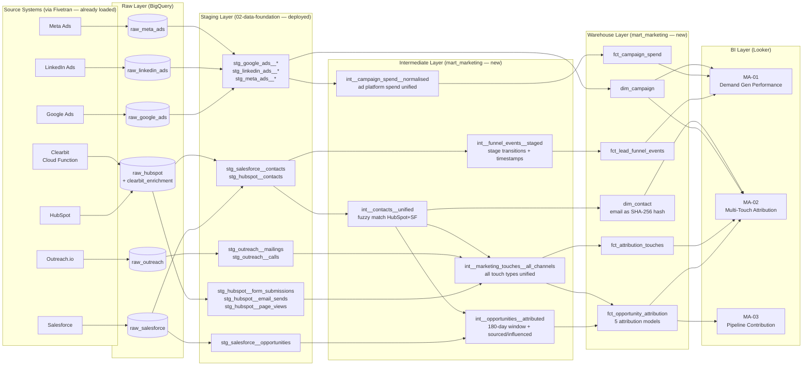

# Pipeline Architecture
## Release: 03-marketing-analytics
## Core Dynamics Data Platform Modernisation

**Client**: Core Dynamics, Inc.
**Prepared by**: Sophie Tanner, Rittman Analytics
**Date**: 2026-03-24
**Version**: 1.0
**Dependency**: 02-data-foundation pipeline must be deployed and all staging models passing assertions

---

## 1. Overview

The marketing analytics pipeline builds exclusively on top of staging models delivered in Release 02 (data-foundation). No new ingestion infrastructure is required — Fivetran connectors, Cloud Functions, and Cloud Composer DAGs are already in operation. This release adds a new Dataform transformation layer: intermediate models and warehouse models in the `mart_marketing` BigQuery dataset.

The pipeline transforms raw marketing engagement, campaign spend, and CRM data into five attribution-ready warehouse models, a campaign dimension, a contact dimension, and three dashboard-ready aggregates.

---

## 2. Source Analysis

All sources below are already landing in BigQuery raw datasets via the 02-data-foundation pipeline. The staging models for each are deployed and passing assertions.

| Source | Raw Dataset | Key Staging Models | Key Objects for Marketing Analytics | Refresh Cadence |
|--------|-----------|--------------------|--------------------------------------|----------------|
| Salesforce | raw_salesforce | stg_salesforce__contacts, stg_salesforce__opportunities, stg_salesforce__campaigns, stg_salesforce__accounts | Contacts, Opportunities (ARR, stage, close date), Campaigns, Stage history | Daily incremental |
| HubSpot | raw_hubspot | stg_hubspot__contacts, stg_hubspot__form_submissions, stg_hubspot__email_sends, stg_hubspot__page_views | Contacts (lifecycle stages + timestamps), Engagements (form, email, page view), Campaign memberships | Daily incremental (near-real-time) |
| Google Ads | raw_google_ads | stg_google_ads__campaigns, stg_google_ads__ad_groups | Campaign + ad group spend, impressions, clicks | Daily full refresh |
| LinkedIn Ads | raw_linkedin_ads | stg_linkedin_ads__campaigns, stg_linkedin_ads__creatives | Campaign + creative spend, impressions, clicks | Daily full refresh |
| Meta Ads | raw_meta_ads | stg_meta_ads__campaigns, stg_meta_ads__ad_sets | Campaign + ad set spend, impressions, clicks | Daily full refresh |
| Outreach.io | raw_outreach | stg_outreach__sequences, stg_outreach__mailings, stg_outreach__calls | SDR email touches, call touches | Daily incremental |
| Clearbit (via Cloud Function) | raw_hubspot | Clearbit enrichment table (raw_hubspot.clearbit_enrichment) | Firmographic enrichment for contacts | Event-driven (HubSpot webhook) |

---

## 3. Data Gap Analysis

Gaps identified relative to the conceptual model, cross-referenced with available staging models:

| Gap | Description | Mitigation |
|-----|-------------|-----------|
| HubSpot-Salesforce contact mismatch (~12%) | ~12% of HubSpot contacts cannot be matched to Salesforce contacts by ID | Fuzzy match in integration layer: SHA-256 email hash primary; company domain fallback; unmatched contacts retained with NULL account_fk |
| UTM data missing (~30% of touches) | 30% of marketing touches lack UTM parameters and cannot be attributed to a campaign | Tag as channel = 'unattributed'; do not drop; surface coverage % in MA-01 dashboard data coverage tile |
| HubSpot stage timestamps | SAL/MQL timestamps may require audit log reconstruction if native `became_sal_date` field not populated | Check stg_hubspot__contacts for field availability; fallback to `hs_lifecyclestage_sal_date` or engagement audit if absent |
| LinkedIn Ads creative-level granularity | FR-002 requires ad group level; LinkedIn Fivetran connector delivers creative-level by default | Map creative → ad group using `stg_linkedin_ads__creatives` campaign_group_id field |
| Meta Ads campaign_type classification | Meta ad sets lack a native campaign_type field | Derive campaign_type from ad set naming convention (regex rules; manual seed override table) |
| Clearbit enrichment coverage | Not all contacts will have been enriched (only contacts created via HubSpot webhook after Cloud Function deployment) | Join on hubspot_contact_id; NULL values acceptable per FR-006 spec |
| Outreach-HubSpot contact join | Outreach uses prospect email; HubSpot uses contact email; ~12% mismatch risk | Same fuzzy match logic as HubSpot-Salesforce; email hash primary; flag unmatched Outreach touches as channel = 'sdr_unmatched' |

---

## 4. Transformation Layer Architecture

### Layer 1: Staging (Already Deployed — 02-data-foundation)

No new staging models are required. All input staging models are in the `staging` BigQuery dataset and are owned by the 02-data-foundation release.

Staging models consumed by this release:
- `staging.stg_salesforce__contacts`
- `staging.stg_salesforce__opportunities`
- `staging.stg_salesforce__campaigns`
- `staging.stg_salesforce__accounts`
- `staging.stg_hubspot__contacts`
- `staging.stg_hubspot__form_submissions`
- `staging.stg_hubspot__email_sends`
- `staging.stg_hubspot__page_views`
- `staging.stg_google_ads__campaigns`
- `staging.stg_google_ads__ad_groups`
- `staging.stg_linkedin_ads__campaigns`
- `staging.stg_linkedin_ads__creatives`
- `staging.stg_meta_ads__campaigns`
- `staging.stg_meta_ads__ad_sets`
- `staging.stg_outreach__sequences`
- `staging.stg_outreach__mailings`
- `staging.stg_outreach__calls`

### Layer 2: Intermediate (New — This Release)

Intermediate models perform cross-system joins, deduplication, and business logic that is shared across multiple warehouse models. Materialised as views in the `intermediate` BigQuery dataset.

| Model | Description | Key Logic |
|-------|-------------|-----------|
| `int__contacts__unified` | HubSpot + Salesforce contacts unified with fuzzy match | Email hash join → company domain fallback → unmatched flagged |
| `int__marketing_touches__all_channels` | All touch events unioned from HubSpot engagements + Outreach | Normalise touch_type, channel; tag UTM-less as unattributed; assign campaign_id |
| `int__campaign_spend__normalised` | Google Ads + LinkedIn Ads + Meta Ads spend unified at campaign/ad-group level | Resolve LinkedIn creative → ad group; Meta campaign_type classification |
| `int__opportunities__attributed` | Opportunities with all qualifying touches in 180-day window | Join contacts to opportunities; filter touches to influence window; add sourced/influenced flags |
| `int__funnel_events__staged` | HubSpot lifecycle stage transitions per contact | Extract stage entry/exit timestamps; calculate days_in_stage; SAL stage extraction |

### Layer 3: Warehouse (New — This Release)

Warehouse models are the final, consumer-facing tables in `mart_marketing`. Materialised as tables (incremental where appropriate).

| Model | Type | Grain | Description |
|-------|------|-------|-------------|
| `fct_lead_funnel_events` | Fact | one row per contact per stage transition | Lead funnel with timestamps per stage (FR-001) |
| `fct_campaign_spend` | Fact | one row per channel/campaign/ad-group/day | Daily spend from all paid platforms (FR-002) |
| `fct_attribution_touches` | Fact | one row per contact per touch | All marketing touches with channel/campaign/asset (FR-003) |
| `fct_opportunity_attribution` | Fact | one row per opportunity per touch per attribution model | Revenue attribution under 5 models (FR-004) |
| `dim_campaign` | Dimension | one row per campaign | Campaign with channel, type, segment, budget (FR-005) |
| `dim_contact` | Dimension | one row per contact | Contacts with Clearbit enrichment; email as SHA-256 hash only (FR-006) |

---

## 5. Data Flow Diagram

---

## 6. Scheduling and Orchestration

Marketing analytics models run in the existing `dataform_run_dag` Cloud Composer DAG, extended with a new tag-based execution phase:

| Phase | Dataform Tag | Models | Trigger |
|-------|-------------|--------|---------|
| Staging | `staging` | All staging models (02-data-foundation) | After Fivetran syncs complete (~07:30 UTC) |
| Intermediate (marketing) | `intermediate_marketing` | All `int__*` models in mart_marketing | After staging completes |
| Warehouse (marketing) | `warehouse_marketing` | All `fct_*` and `dim_*` in mart_marketing | After intermediate_marketing completes |

**Daily schedule**: Staging complete by ~07:30 UTC; marketing intermediate + warehouse models complete by 08:00 UTC (before Monday 08:00 UTC standup target per NFR-003).

Ad platform data (Google Ads, LinkedIn Ads, Meta Ads) is available in BigQuery by 07:00 UTC (per data quality assertions in 02-data-foundation). Marketing warehouse models can safely depend on these being present.

---

## 7. Error Handling

| Scenario | Detection | Response |
|----------|-----------|---------|
| Staging model fails | Dataform assertion failure; `dataform_run_dag` fails at staging phase | Intermediate + warehouse marketing models are blocked by dependency; Slack alert to #data-platform-alerts |
| HubSpot-Salesforce join produces unexpected null rate | Data quality assertion on `int__contacts__unified` — alert if unmatched > 15% | Alert to #data-platform-alerts; investigation required before MA-01 dashboard is trusted |
| Attribution model produces incorrect totals | Dataform assertion: sum of attributed_revenue_usd per opportunity per model ≠ opportunity ARR | Fail the marketing warehouse run; alert; block dashboard refresh |
| UTM coverage drops below 50% | Data quality assertion on `fct_attribution_touches` — alert if unattributed > 60% | Alert to Niamh Collins (UTM enforcement); surface in MA-01 data coverage tile |
| fct_opportunity_attribution row count anomaly | Assert row count ≥ prior day × 0.95 | Slack alert |

---

## 8. Security and Governance

| Concern | Approach |
|---------|---------|
| PII — contact emails | SHA-256 hash at `int__contacts__unified` layer; no plain-text email in mart_marketing dataset; inherited from 02-data-foundation PII handling |
| Looker row-level security | Not required for marketing analytics (all marketing team members see same data); MA-03 restricted to executive access via Looker user attribute if required |
| BigQuery access control | `mart_marketing` dataset: read access for Looker service account + Rachel Summers, Owen Brady, Niamh Collins, David Park (CRO), Marcus Elwood (CEO); write access for Dataform service account only |
| Attribution model weights | U-shaped weights (40/40/20) stored as dbt vars in `dbt_project.yml` — not hardcoded in SQL; configurable without model rebuild |

---

## 9. Technology Stack

| Component | Technology | Purpose |
|-----------|-----------|---------|
| Raw ingestion | Fivetran (existing) + Clearbit Cloud Function (existing) | Source data landing |
| Staging layer | Dataform (existing — 02-data-foundation) | Source model cleaning |
| Intermediate layer | Dataform (new — this release) | Cross-system joins, attribution logic |
| Warehouse layer | Dataform (new — this release) | Consumer-facing marketing models |
| Orchestration | Cloud Composer 2 / Airflow (existing DAGs, extended) | Pipeline scheduling |
| BI / semantic layer | Looker + LookML (new views and explores) | Dashboard and self-service analytics |
| Target dataset | BigQuery `mart_marketing` | All warehouse and fact/dim models |

---

## 10. Design Decisions

| Decision | Rationale |
|----------|-----------|
| **No new staging models** — reuse 02-data-foundation staging | All required source data is already staged and tested; adding staging models here would create ownership ambiguity and duplicate test coverage |
| **Attribution logic in warehouse layer (fct), not intermediate** | Attribution is a complex, multi-pass calculation; keeping it in a dedicated `fct_opportunity_attribution` model makes it auditable and testable independently of touch extraction |
| **5 models as rows, not columns** | One row per opportunity × touch × model (long format) is more flexible for Looker filtering and dimension-based model switching than 5 columns on a single row |
| **180-day window applied at `int__opportunities__attributed`** | Filtering touches to the influence window in the intermediate layer reduces the cardinality of `fct_opportunity_attribution` by ~3–4× vs. applying it at the warehouse layer |
| **Unattributed touches retained (not filtered)** | ~30% UTM gap means filtering would distort channel-level attribution; tagging as 'unattributed' preserves completeness and allows Niamh Collins to track UTM adoption over time |
| **U-shaped weights as dbt vars** | Business may want to test weight variants (e.g., 50/30/20); storing in `dbt_project.yml` avoids a model rebuild to adjust |
| **dim_contact pseudonymises at integration layer** | PII pseudonymisation at `int__contacts__unified` ensures no plain-text email reaches any downstream model — consistent with 02-data-foundation PII policy and Priya Nair sign-off |
