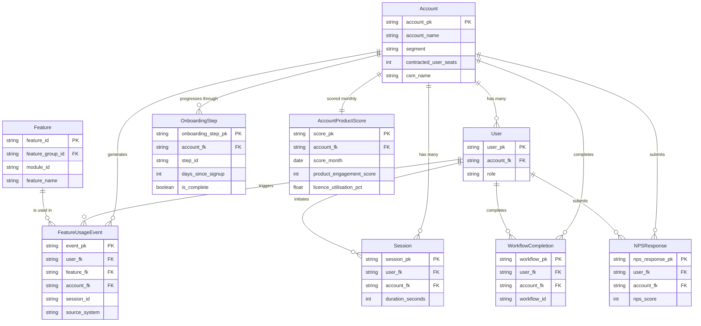

# Conceptual Model — Product Analytics
## Release: 04-product-analytics
## Core Dynamics Data Platform Modernisation

**Version**: 1.0 (Autopilot — self-reviewed)
**Date**: 2026-03-24

---

## Entities

### Account
The top-level organisational unit — a paying customer of Core Dynamics. Maps to Salesforce Account. Has a segment (Enterprise, Mid-Market, SMB, Strategic), contracted user seats, and an assigned CSM.

**Key attributes**: account_pk, account_name, segment, contracted_user_seats, csm_name, salesforce_account_id, account_created_date

**Approximate volume**: 312 accounts

---

### User
An individual end-user of CoreFM. Belongs to one Account. User identity is stored only as a SHA-256 hash — plain-text user IDs and emails are never stored in the warehouse.

**Key attributes**: user_pk (SHA-256 hash), account_fk, role, first_login_date, last_login_date

**Approximate volume**: ~12,000 users

---

### Feature
A specific action or capability within CoreFM. Has a three-level hierarchy: Feature belongs to a Feature Group, which belongs to a Module.

**Key attributes**: feature_id, feature_name, feature_group_id, feature_group_name, module_id, module_name

**Approximate volume**: ~200 features across ~30 feature groups and 8 modules

---

### FeatureUsageEvent
A single interaction between a User and a Feature, recorded as an event. Sourced from Segment (transactional events) or Mixpanel (discovery events) depending on event category.

**Key attributes**: event_pk, user_fk, feature_fk, account_fk, event_timestamp, source_system, session_id

**Approximate volume**: ~5M events/month

---

### Session
A continuous period of user activity within CoreFM, bounded by a session_start and session_end event. Sourced from Segment.

**Key attributes**: session_pk, user_fk, account_fk, session_start_ts, session_end_ts, duration_seconds, page_count

**Approximate volume**: ~800K sessions/month

---

### OnboardingStep
One of seven defined onboarding milestone actions for a new Account. Each step has a defined step_id and description. Tracked via Intercom onboarding checklist.

**Key attributes**: onboarding_step_pk, account_fk, step_id, step_name, completed_at, days_since_signup, is_core_step

**Approximate volume**: ~2,184 account-step combinations (312 accounts × 7 steps)

---

### WorkflowCompletion
A record of a user completing a defined multi-step workflow within CoreFM (e.g., completing a work order from creation to closure). Sourced from Mixpanel workflow completion events.

**Key attributes**: workflow_pk, user_fk, account_fk, workflow_id, workflow_name, completed_at, duration_seconds

**Approximate volume**: ~200K completions/month

---

### AccountProductScore
A monthly snapshot of a composite product engagement score (0–100) for an Account. Aggregates 7 signals. Retained monthly for trend analysis.

**Key attributes**: score_pk, account_fk, score_month, product_engagement_score, dau_mau_ratio, feature_breadth_score, core_activation_score, work_order_signal, licence_utilisation_pct, nps_score, onboarding_completion_pct

**Approximate volume**: ~312 rows/month; ~3,744 rows/year

---

### NPSResponse
An NPS survey response from a user, sourced from Intercom. Used as an input to the ProductEngagementScore.

**Key attributes**: nps_response_pk, user_fk, account_fk, nps_score, responded_at

**Approximate volume**: ~500 responses/quarter

---

## Entity Relationship Diagram

---

## Out of Scope Entities

| Entity | Reason |
|--------|--------|
| CustomerHealthScore | Built in Release 05 — combines ProductEngagementScore with support, sentiment, financial signals |
| ChurnPrediction | BQML model in Release 05 |
| ARR / MRR | Financial data modelled in Release 05 (NetSuite) |
| SupportTicket | Zendesk data modelled in Release 06 (Operational Analytics) |
| IoTDevice | CoreFM IoT telemetry out of scope; Step 6 of onboarding tracked via Intercom event only |
