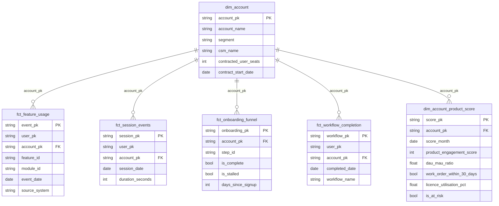

# Data Model Specification — Product Analytics
## Release: 04-product-analytics
## Core Dynamics Data Platform Modernisation

**Version**: 1.0 (Autopilot — self-reviewed)
**Date**: 2026-03-24

---

## 1. dbt Project Variables

Variables defined in `dbt/dbt_project.yml` (additions for product analytics):

```yaml
vars:
  # --- Product Analytics ---
  product_stalled_days_threshold: 14          # Days without onboarding progress = stalled
  product_at_risk_score_threshold: 40         # Score below this = at-risk flag in PB-03
  product_score_dau_mau_weight: 0.20          # 20%
  product_score_feature_breadth_weight: 0.20  # 20%
  product_score_core_activation_weight: 0.20  # 20%
  product_score_work_order_signal_weight: 0.10 # 10%
  product_score_licence_util_weight: 0.05     # 5%
  product_score_nps_weight: 0.15             # 15%
  product_score_onboarding_weight: 0.10      # 10%
  product_dau_mau_window_days: 30            # Rolling window for active user calculation
  product_licence_util_window_days: 30       # Rolling window for licence utilisation
  product_nps_window_days: 180               # NPS response validity window
```

---

## 2. Seed Files

| Seed | Columns | Description |
|------|---------|-------------|
| `feature_taxonomy` | `event_name, feature_id, feature_name, feature_group_id, feature_group_name, module_id, module_name, source_system_authoritative` | Maps Mixpanel/Segment event_name to 3-level feature hierarchy |
| `onboarding_steps` | `step_id, step_name, step_order, is_core_step, target_days_min, target_days_max` | Defines the 7 onboarding steps with expected timing |
| `product_health_thresholds` | `threshold_name, threshold_value` | Configurable score thresholds (at_risk, healthy, excellent) |
| `account_segment_rules` | `segment, acv_min, acv_max, employee_min, employee_max, priority` | Segment classification rules; Strategic has priority=1 |

---

## 3. Integration Models

### int__feature_usage

**Path**: `dbt/models/integration/int__feature_usage.sql`
**Materialization**: View
**Tags**: `integration`, `intermediate_product`

**Column specification**:

| Column | Type | Description |
|--------|------|-------------|
| event_pk | STRING | Surrogate key: SHA-256(source_system + event_id) |
| user_pk | STRING | SHA-256(user_id) — pseudonymised |
| account_pk | STRING | FK to dim_account |
| feature_id | STRING | FK to feature_taxonomy seed |
| feature_group_id | STRING | From feature_taxonomy |
| module_id | STRING | From feature_taxonomy |
| event_name | STRING | Original event name from source |
| event_timestamp_utc | TIMESTAMP | UTC timestamp of event |
| event_date | DATE | Partition date |
| source_system | STRING | 'segment' or 'mixpanel' |
| session_id | STRING | Session ID from source (nullable for Mixpanel events without session) |

**dbt tests**: unique(event_pk), not_null(event_pk), not_null(user_pk), not_null(account_pk), not_null(feature_id), relationships(feature_id → feature_taxonomy.event_name)

---

### int__account_sessions

**Path**: `dbt/models/integration/int__account_sessions.sql`
**Materialization**: View
**Tags**: `integration`, `intermediate_product`

| Column | Type | Description |
|--------|------|-------------|
| session_pk | STRING | Surrogate key: SHA-256(session_id) |
| user_pk | STRING | SHA-256(user_id) |
| account_pk | STRING | FK to dim_account |
| session_start_ts | TIMESTAMP | Session start timestamp (UTC) |
| session_end_ts | TIMESTAMP | Session end timestamp (UTC); NULL if session not closed |
| session_date | DATE | Date of session start |
| duration_seconds | INT64 | NULL if session_end_ts is NULL |
| page_count | INT64 | Number of page views in session |
| event_count | INT64 | Number of events in session |

---

### int__onboarding

**Path**: `dbt/models/integration/int__onboarding.sql`
**Materialization**: View
**Tags**: `integration`, `intermediate_product`

| Column | Type | Description |
|--------|------|-------------|
| onboarding_pk | STRING | Surrogate key: SHA-256(account_pk + step_id) |
| account_pk | STRING | FK to dim_account |
| step_id | STRING | Onboarding step identifier |
| step_order | INT64 | Step sequence number (1–7) |
| is_core_step | BOOLEAN | TRUE for steps 1–5 |
| is_complete | BOOLEAN | TRUE if completion event recorded |
| completed_at | TIMESTAMP | NULL if not complete |
| days_since_signup | INT64 | Days from contract start to completion; NULL if not complete |
| is_stalled | BOOLEAN | TRUE if not complete AND days since prior step > stalled_days_threshold var |

---

## 4. Warehouse Models

### fct_feature_usage

**Path**: `dbt/models/warehouse/core/fct_feature_usage.sql`
**Materialization**: Incremental (unique_key: event_pk; partition: event_date; cluster: account_pk, module_id)
**Tags**: `warehouse`, `warehouse_product`

| Column | Type | Description |
|--------|------|-------------|
| event_pk | STRING PK | |
| user_pk | STRING FK | Pseudonymised |
| account_pk | STRING FK | |
| feature_id | STRING | |
| feature_name | STRING | |
| feature_group_id | STRING | |
| feature_group_name | STRING | |
| module_id | STRING | |
| module_name | STRING | |
| event_name | STRING | |
| event_date | DATE | Partition column |
| event_timestamp_utc | TIMESTAMP | |
| source_system | STRING | 'segment' or 'mixpanel' |
| session_id | STRING | |

---

### fct_session_events

**Path**: `dbt/models/warehouse/core/fct_session_events.sql`
**Materialization**: Incremental (unique_key: session_pk; partition: session_date)
**Tags**: `warehouse`, `warehouse_product`

| Column | Type | Description |
|--------|------|-------------|
| session_pk | STRING PK | |
| user_pk | STRING FK | Pseudonymised |
| account_pk | STRING FK | |
| session_date | DATE | |
| session_start_ts | TIMESTAMP | |
| session_end_ts | TIMESTAMP | |
| duration_seconds | INT64 | |
| page_count | INT64 | |
| event_count | INT64 | |

---

### fct_onboarding_funnel

**Path**: `dbt/models/warehouse/core/fct_onboarding_funnel.sql`
**Materialization**: Table
**Tags**: `warehouse`, `warehouse_product`

| Column | Type | Description |
|--------|------|-------------|
| onboarding_pk | STRING PK | |
| account_pk | STRING FK | |
| account_name | STRING | Denormalised from dim_account |
| csm_name | STRING | Denormalised from dim_account |
| step_id | STRING | |
| step_name | STRING | |
| step_order | INT64 | 1–7 |
| is_core_step | BOOLEAN | |
| is_complete | BOOLEAN | |
| completed_at | TIMESTAMP | |
| days_since_signup | INT64 | |
| is_stalled | BOOLEAN | |
| is_at_risk | BOOLEAN | Account score < at_risk_threshold var |

---

### fct_workflow_completion

**Path**: `dbt/models/warehouse/core/fct_workflow_completion.sql`
**Materialization**: Incremental (unique_key: workflow_pk; partition: completed_date)
**Tags**: `warehouse`, `warehouse_product`

| Column | Type | Description |
|--------|------|-------------|
| workflow_pk | STRING PK | |
| user_pk | STRING FK | |
| account_pk | STRING FK | |
| workflow_id | STRING | Mixpanel workflow_id |
| workflow_name | STRING | Human-readable workflow name |
| completed_at | TIMESTAMP | |
| completed_date | DATE | Partition column |
| duration_seconds | INT64 | |
| step_count | INT64 | Number of steps in the workflow |

---

### dim_account

**Path**: `dbt/models/warehouse/core/dim_account.sql`
**Materialization**: Table (SCD Type 1)
**Tags**: `warehouse`, `warehouse_product`

| Column | Type | Description |
|--------|------|-------------|
| account_pk | STRING PK | SHA-256(salesforce_account_id) |
| salesforce_account_id | STRING | Source system key |
| account_name | STRING | |
| segment | STRING | Enterprise / Mid-Market / SMB / Strategic |
| csm_name | STRING | From Salesforce Account.CSM__c lookup |
| contracted_user_seats | INT64 | From Salesforce Contract.User_Seats__c; NULL if not on file |
| contract_start_date | DATE | From Salesforce Contract |
| arr_usd | FLOAT64 | From Salesforce — for Release 05 use; populated here for join convenience |
| account_created_date | DATE | |
| is_active | BOOLEAN | |

**Note**: `arr_usd` is included here for convenience joins with Release 05 customer models. It is not exposed in PB dashboards.

---

### dim_account_product_score

**Path**: `dbt/models/warehouse/core/dim_account_product_score.sql`
**Materialization**: Table (full rebuild monthly)
**Tags**: `warehouse`, `warehouse_product`

**Product Engagement Score Formula**:
```sql
product_engagement_score = LEAST(100, GREATEST(0, ROUND(
    (COALESCE(dau_mau_ratio, 0) * 100 * {{ var('product_score_dau_mau_weight') }})
  + (COALESCE(feature_breadth_normalised, 0) * 100 * {{ var('product_score_feature_breadth_weight') }})
  + (COALESCE(core_activation_score, 0) * 100 * {{ var('product_score_core_activation_weight') }})
  + (CASE WHEN work_order_within_30_days THEN 100 ELSE 0 END * {{ var('product_score_work_order_signal_weight') }})
  + (COALESCE(licence_utilisation_pct, 0) * 100 * {{ var('product_score_licence_util_weight') }})
  + (COALESCE(nps_normalised, 0) * 100 * {{ var('product_score_nps_weight') }})
  + (COALESCE(onboarding_completion_pct, 0) * 100 * {{ var('product_score_onboarding_weight') }})
, 0)))
```

| Column | Type | Description |
|--------|------|-------------|
| score_pk | STRING PK | SHA-256(account_pk + score_month) |
| account_pk | STRING FK | |
| score_month | DATE | First day of the scoring month |
| product_engagement_score | INT64 | 0–100 composite |
| dau_mau_ratio | FLOAT64 | DAU ÷ MAU for the 30-day window |
| active_users_30d | INT64 | Distinct users with ≥1 session in last 30 days |
| feature_breadth_normalised | FLOAT64 | distinct_features_used / total_features in taxonomy; 0–1 |
| distinct_features_used | INT64 | |
| core_activation_score | FLOAT64 | % of core features used at least once; 0–1 |
| work_order_within_30_days | BOOLEAN | |
| licence_utilisation_pct | FLOAT64 | active_users / contracted_seats; NULL if seats unknown |
| nps_score_last_response | INT64 | Most recent NPS score (0–10) |
| nps_normalised | FLOAT64 | nps_score / 10 |
| onboarding_completion_pct | FLOAT64 | core steps completed / 5; 0–1 |
| core_steps_completed | INT64 | Count of core onboarding steps completed (max 5) |
| is_at_risk | BOOLEAN | product_engagement_score < at_risk_threshold var |

---

## 5. Physical ERD



---

## 6. Cross-Release Joins

`dim_account.account_pk` is the shared key between this release and Release 05 (Customer Analytics). The surrogate key is computed as `SHA-256(salesforce_account_id)` to ensure consistency.

`dim_account_product_score` will be joined by Release 05's `dim_account_health` to include the product score as a component in the customer health score.
