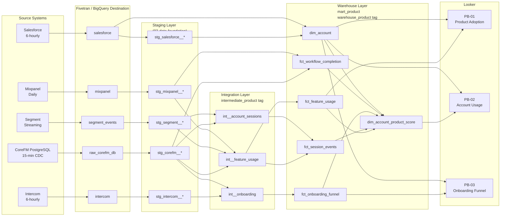

# Pipeline Architecture — Product Analytics
## Release: 04-product-analytics
## Core Dynamics Data Platform Modernisation

**Version**: 1.0 (Autopilot — self-reviewed)
**Date**: 2026-03-24

---

## 1. Overview

This release adds no new Fivetran connectors. All required source systems (CoreFM PostgreSQL via CDC, Segment via BigQuery Destination, Mixpanel via Fivetran, Intercom via Fivetran, Salesforce via Fivetran) were deployed in Release 02 (Data Foundation).

The release extends the existing `dataform_run_dag` Cloud Composer DAG with two new phases: `intermediate_product` and `warehouse_product`, mirroring the pattern established in Release 03.

---

## 2. Source Systems

| Source | BigQuery Dataset | Refresh | Key Tables | Data Category |
|--------|----------------|---------|-----------|---------------|
| CoreFM PostgreSQL | `raw_corefm_db` | 15-min CDC | users, accounts, work_orders, assets, contracts | Transactional |
| Segment | `segment_events` (streaming) | Near real-time | tracks, sessions, identifies | Session + transactional events |
| Mixpanel | `mixpanel` | Daily | events, people, funnels | Discovery + workflow events |
| Intercom | `intercom` | 6-hourly | conversations, events, users, nps_surveys | Onboarding + NPS |
| Salesforce | `salesforce` | 6-hourly | Account, Contract, User (CSM), Opportunity | Account + licence data |

---

## 3. Data Flow Diagram



---

## 4. Integration Layer Design

### int__feature_usage
**Purpose**: Unified feature events from Segment (transactional) and Mixpanel (discovery), with feature taxonomy applied and duplicates removed.

**Logic**:
1. Select core transactional events from `stg_segment__tracks` where `event_name` in the authoritative transactional event list
2. Select discovery events from `stg_mixpanel__events` where `event_name` NOT in the Segment-authoritative list
3. UNION ALL the two sets
4. Join to `feature_taxonomy` seed on `event_name` to add `module_id`, `feature_group_id`, `feature_id`
5. Apply `SHA-256(user_id)` pseudonymisation
6. Deduplicate on `(user_pk, event_name, event_timestamp_utc)` — keep Segment record on conflict

**Output grain**: One row per user × event × timestamp (deduplicated)

### int__account_sessions
**Purpose**: Session-level aggregates per account from Segment session events.

**Logic**:
1. Source from `stg_segment__sessions`
2. Join to account via user-to-account mapping from `stg_corefm__users`
3. Aggregate to session grain: session_start, session_end, page_count, event_count

**Output grain**: One row per session

### int__onboarding
**Purpose**: Onboarding step completions per account from Intercom checklist events.

**Logic**:
1. Source from `stg_intercom__events` where `event_type` in the 7 onboarding step IDs
2. Join to account via Intercom company_id → Salesforce account mapping
3. Calculate `days_since_signup` from Salesforce contract start date
4. Mark `is_core_step` (TRUE for steps 1–5)
5. Mark `is_stalled` where step not completed and days since prior step > 14

**Output grain**: One row per account × step

---

## 5. Warehouse Layer Design

| Model | Grain | Materialization | Partition/Cluster |
|-------|-------|----------------|-------------------|
| fct_feature_usage | One row per user × event × date | Incremental (event_date) | Partition: event_date; Cluster: account_pk, module_id |
| fct_session_events | One row per session | Incremental (session_date) | Partition: session_date; Cluster: account_pk |
| fct_onboarding_funnel | One row per account × step | Table | Cluster: account_pk |
| fct_workflow_completion | One row per workflow completion | Incremental (completed_date) | Partition: completed_date; Cluster: account_pk |
| dim_account | One row per account (SCD Type 1) | Table | No partition |
| dim_account_product_score | One row per account × month | Table | Cluster: account_pk, score_month |

---

## 6. Dataform Tags

New Dataform execution tags added in this release:

| Tag | Applied To | Phase |
|-----|-----------|-------|
| `intermediate_product` | `int__feature_usage`, `int__account_sessions`, `int__onboarding` | Phase 4 (after warehouse) |
| `warehouse_product` | All 6 `mart_product` models | Phase 5 (after intermediate_product) |

**Extended DAG dependency chain**:
```
staging → integration → warehouse → intermediate_marketing → warehouse_marketing
                                  → intermediate_product → warehouse_product
```

*Note*: `intermediate_marketing` and `warehouse_product` can run in parallel; they have no cross-dependency.

---

## 7. Design Decisions

| Decision | Choice | Rationale |
|----------|--------|-----------|
| Event deduplication strategy | Keep Segment for overlapping events; use QUALIFY ROW_NUMBER on (user_pk, event_name, timestamp) | Segment server-side is more reliable; Mixpanel may fire multiple events for same action |
| fct_feature_usage materialization | Incremental | ~5M events/month; full rebuild is too slow for daily pipeline |
| dim_account_product_score materialization | Full table rebuild | Score depends on rolling 30-day windows; incremental would require complex lookback logic |
| User ID pseudonymisation | SHA-256(user_id) | Consistent with Release 03 email pseudonymisation pattern; no plain-text IDs in warehouse |
| Feature taxonomy | Seed table (CSV) | Leon Yip owns updates; CSV is manageable without code changes |
| Stalled flag | dbt var configurable, default 14 days | Allows CS team to adjust sensitivity without developer involvement |
| Product score weights | dbt vars (not hardcoded) | Allows adjustment post-delivery without code change; requires redeploy of `dim_account_product_score` |
