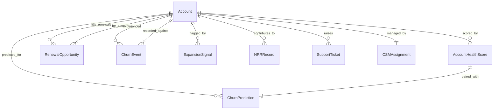

# Conceptual Model — Customer Analytics
## Release: 05-customer-analytics
## Core Dynamics Data Platform Modernisation

**Date**: 2026-03-25 | **Author**: Sophie Tanner, Rittman Analytics

---

## Overview

This model covers the customer analytics domain: account health, churn risk, renewal pipeline, CSM book of business, NRR/GRR, and expansion signals. The primary entity is **Account**, shared with Release 04 (`dim_account`). This release builds the financial and CS-operations layer on top of the product engagement layer.

---

## Entities

### Account
The core unit of customer analytics — a B2B enterprise customer of Core Dynamics. 312 active accounts.
- **Key attributes**: account_pk (SHA-256 of salesforce_account_id), account_name, csm_owner, segment, arr_usd, renewal_date, contract_start_date, region
- **Volume**: ~312 active; ~50 churned (historical)

### AccountHealthScore
Daily composite health score per account, combining 5 signal components.
- **Key attributes**: account_pk, score_date, health_score (0–100), health_band, product_signal, support_signal, financial_signal, relationship_signal, nps_signal, trend_direction
- **Volume**: 312 accounts × 365 days = ~114K rows/year

### ChurnPrediction
BQML logistic regression output: daily churn probability per account.
- **Key attributes**: account_pk, prediction_date, churn_probability (0–1), churn_risk_band (Low/Medium/High/Critical), model_version
- **Volume**: 312 accounts daily

### RenewalOpportunity
Salesforce opportunity representing an upcoming or past renewal.
- **Key attributes**: opportunity_pk, account_pk, renewal_date, arr_usd, weighted_arr_usd, renewal_stage, days_to_renewal, csm_owner
- **Volume**: ~600 renewal opportunities (trailing 3 years)

### ChurnEvent
A completed churn or contraction event — full churn, non-renewal, or ARR contraction.
- **Key attributes**: churn_event_pk, account_pk, event_date, churn_type, arr_impacted, reason_category, reason_detail, csm_owner
- **Volume**: ~50 churn events per year (estimated)

### ExpansionSignal
An account flagged as a potential expansion candidate based on engagement and utilisation.
- **Key attributes**: signal_pk, account_pk, signal_date, signal_type (expansion/upsell), trigger_criteria, arr_opportunity_estimate, is_active
- **Volume**: ~30–50 signals active at any time

### NRRRecord
Monthly NRR/GRR calculation per account contributing to company-level roll-up.
- **Key attributes**: account_pk, month_start, beginning_arr, expansion_arr, contraction_arr, churn_arr, ending_arr, nrr, grr
- **Volume**: 312 accounts × 24 months = ~7.5K rows

### SupportTicket
Zendesk support ticket raised by an account contact.
- **Key attributes**: ticket_pk, account_pk, created_date, resolved_date, priority, status, csat_score, resolution_hours, agent
- **Volume**: ~5K tickets/year

### CSMAssignment
A CSM's book of business — the set of accounts assigned to a CSM and their health summary.
- **Key attributes**: csm_owner, account_pk, assigned_date, health_score, churn_risk_band, arr_usd, open_actions_count
- **Volume**: 312 rows (one per account)

---

## Relationships

---

## Relationship Narratives

- **Account → AccountHealthScore**: Each Account is evaluated with a health score on each calendar day. The health score aggregates product, support, financial, relationship, and NPS signals into a single composite index.
- **Account → ChurnPrediction**: Each Account receives a daily churn probability from the BQML logistic regression model. The prediction is joined to the health score for combined dashboard surfacing.
- **Account → RenewalOpportunity**: An Account may have multiple renewal opportunities over its lifetime (one per contract period). Only upcoming renewals are surfaced in the pipeline view.
- **Account → ChurnEvent**: When an account churns, contracts, or fails to renew, a Churn Event is recorded. An account may have multiple events (e.g., contraction followed by full churn).
- **Account → ExpansionSignal**: When an account meets expansion criteria (high engagement + low licence utilisation), an active Expansion Signal is recorded. Signals are deactivated when the account upgrades or the criteria no longer apply.
- **Account → NRRRecord**: Each month, every active account contributes one NRR Record capturing the ARR movement components. These roll up to company-level NRR/GRR.
- **Account → SupportTicket**: An Account raises support tickets via Zendesk. The aggregate ticket health (CSAT, resolution time, volume) feeds the Support Signal in AccountHealthScore.
- **Account → CSMAssignment**: Each Account is assigned to exactly one CSM. The CSMAssignment captures the current book-of-business state, used for RLS filtering in the CSM dashboard.
- **AccountHealthScore → ChurnPrediction**: The health score and churn prediction are computed independently but paired by account_pk and date for dashboard presentation.

---

## Entities Out of Scope

- **Contact / Individual User**: Customer contacts are referenced in Salesforce but individual-level analytics are out of scope (PII policy). All analytics are at account level.
- **Product**: Product catalogue, features, and pricing are managed in CoreFM PostgreSQL and Salesforce — not in scope for this release (covered in Release 04 feature taxonomy).
- **Invoice / Payment**: NetSuite financial data not in scope for this release (ARR sourced from Salesforce).
- **Employee (CSM)**: CSM performance metrics are computed from account outcomes — no BambooHR HR data in scope (Release 06).

---

## Open Questions

1. Does a CSM change mid-contract affect NRR attribution? (Currently all ARR attributed to current CSM at period end)
2. Should multi-product accounts (CoreFM + IoT module) have separate health scores per product line?
3. Expansion signals: should Salesforce upsell opportunity creation automatically deactivate the signal?
