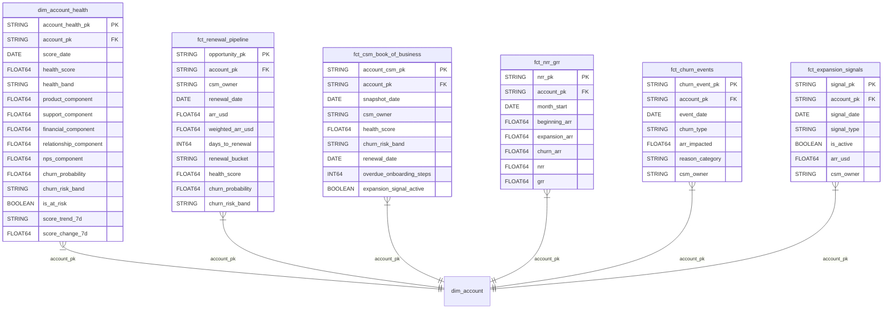

# Data Model Specification — Customer Analytics
## Release: 05-customer-analytics
## Core Dynamics Data Platform Modernisation

**Date**: 2026-03-25 | **Author**: Sophie Tanner, Rittman Analytics

---

## 1. dbt Project Variables

```yaml
# dbt_project.yml additions for release 05

vars:
  # Customer Health Score weights (must sum to 1.0)
  customer_health_product_weight: 0.30
  customer_health_support_weight: 0.20
  customer_health_financial_weight: 0.25
  customer_health_relationship_weight: 0.15
  customer_health_nps_weight: 0.10

  # Health score thresholds
  customer_health_at_risk_threshold: 40
  customer_health_needs_attention_threshold: 60
  customer_health_healthy_threshold: 80

  # Churn model parameters
  churn_risk_low_threshold: 0.20
  churn_risk_medium_threshold: 0.40
  churn_risk_high_threshold: 0.65

  # Renewal pipeline window
  renewal_pipeline_days_forward: 180

  # NRR calculation
  nrr_trailing_months: 12
  nrr_lookback_months: 24

  # Support health
  support_health_csat_weight: 0.50
  support_health_resolution_weight: 0.30
  support_health_volume_weight: 0.20
  support_health_target_csat: 4.2         # Out of 5
  support_health_target_resolution_hrs: 24
  support_health_volume_baseline: 3        # Tickets per month per account (baseline healthy)

  # Relationship health
  relationship_health_qbr_days: 180        # QBR within last N days
  relationship_health_exec_sponsor_required: true
```

---

## 2. Seed Files

### `seeds/customer_health_config.csv`
Configurable weights and thresholds for Customer Health Score signals.

| Column | Type | Description |
|--------|------|-------------|
| signal_name | STRING | Signal identifier (product/support/financial/relationship/nps) |
| weight | FLOAT64 | Contribution weight (must sum to 1.0) |
| description | STRING | Business description of the signal |

### `seeds/churn_risk_thresholds.csv`
Configurable churn probability band boundaries.

| Column | Type | Description |
|--------|------|-------------|
| risk_band | STRING | Band label (Low/Medium/High/Critical) |
| probability_min | FLOAT64 | Lower bound (inclusive) |
| probability_max | FLOAT64 | Upper bound (exclusive) |
| recommended_action | STRING | Suggested CSM playbook action |

### `seeds/nrr_movement_types.csv`
Classification rules for ARR movement types.

| Column | Type | Description |
|--------|------|-------------|
| movement_type | STRING | Type (new_arr/expansion/contraction/churn) |
| salesforce_opp_type | STRING | Salesforce Opportunity.Type value that maps to this |
| is_nrr_component | BOOLEAN | Whether this movement enters NRR formula |
| sign | INTEGER | +1 for positive ARR movement, -1 for negative |

---

## 3. Source Definitions

```yaml
# models/staging/_sources.yml additions

sources:
  - name: churnzero
    database: core-dynamics-analytics-prod
    schema: churnzero
    freshness:
      warn_after: {count: 36, period: hour}
      error_after: {count: 72, period: hour}
    loaded_at_field: _fivetran_synced
    tables:
      - name: account
      - name: health_score
      - name: account_attribute

  # Existing sources already defined in Release 02:
  # salesforce, zendesk, intercom — freshness configurations already set
```

---

## 4. Staging Models (Release 02 Outputs)

All staging models consumed by this release are already defined and deployed in Release 02. This release adds one new staging model:

### `stg_churnzero__account_health.sql`
**Materialisation**: View
**Source**: churnzero.health_score

| Column | Type | Tests | Description |
|--------|------|-------|-------------|
| account_health_pk | STRING | unique, not_null | SHA-256(account_id \|\| health_date) |
| account_pk | STRING | not_null, relationships | SHA-256(salesforce_account_id) — join key |
| health_date | DATE | not_null | Date of health score snapshot |
| churn_score | FLOAT64 | | ChurnZero churn risk score (0–100) |
| engagement_score | FLOAT64 | | ChurnZero engagement score |
| nps_score_churnzero | FLOAT64 | | NPS score from ChurnZero |
| _fivetran_synced | TIMESTAMP | | Fivetran sync timestamp |

---

## 5. Integration Models

### `int__account_health.sql`
**Materialisation**: View
**Tags**: intermediate_customer
**Description**: Assembles 5 health signal components per account per day ready for warehouse materialisation.

| Column | Type | Description |
|--------|------|-------------|
| account_pk | STRING | Shared join key from dim_account |
| score_date | DATE | Calendar date of health signals |
| product_signal_raw | FLOAT64 | Product engagement score (0–100) from dim_account_product_score, interpolated daily from monthly |
| support_csat_avg | FLOAT64 | Average CSAT score in trailing 30 days |
| support_resolution_hrs_avg | FLOAT64 | Average ticket resolution time (hours) in trailing 30 days |
| support_ticket_count | INT64 | Ticket count in trailing 30 days |
| financial_arr_usd | FLOAT64 | Current ARR from Salesforce |
| financial_arr_change_pct | FLOAT64 | ARR change % vs prior year |
| financial_renewal_days | INT64 | Days until next renewal (NULL if no renewal) |
| relationship_qbr_days_since | INT64 | Days since last QBR completed (NULL if never) |
| relationship_exec_sponsor | BOOLEAN | TRUE if executive sponsor identified in Salesforce |
| relationship_open_escalations | INT64 | Count of open escalation tickets |
| nps_score_latest | FLOAT64 | Most recent NPS score within last 180 days (NULL if older) |
| nps_days_since | INT64 | Days since NPS survey response |
| churnzero_churn_score | FLOAT64 | ChurnZero churn risk score (supplementary) |

### `int__renewal_pipeline.sql`
**Materialisation**: View
**Tags**: intermediate_customer
**Description**: Upcoming renewal opportunities enriched with account health context.

| Column | Type | Description |
|--------|------|-------------|
| opportunity_pk | STRING | Salesforce opportunity ID (hashed) |
| account_pk | STRING | Account join key |
| account_name | STRING | Account display name |
| csm_owner | STRING | Assigned CSM |
| renewal_date | DATE | Contract renewal date |
| arr_usd | FLOAT64 | ARR at renewal |
| renewal_stage | STRING | Salesforce opportunity stage |
| days_to_renewal | INT64 | Calendar days from today |
| renewal_bucket | STRING | 30/60/90/180 day bucket |
| latest_health_score | FLOAT64 | Most recent health score |
| health_band | STRING | At Risk / Needs Attention / Healthy / Excellent |

### `int__csm_book.sql`
**Materialisation**: View
**Tags**: intermediate_customer
**Description**: Per-CSM book of business with account health summary and open actions.

| Column | Type | Description |
|--------|------|-------------|
| account_pk | STRING | Account join key |
| account_name | STRING | Account display name |
| csm_owner | STRING | CSM assigned (RLS filter field) |
| segment | STRING | Account segment |
| arr_usd | FLOAT64 | Current ARR |
| health_score | FLOAT64 | Latest daily health score |
| health_band | STRING | Score band |
| churn_risk_band | STRING | Low/Medium/High/Critical |
| renewal_date | DATE | Next renewal date |
| days_to_renewal | INT64 | Days until renewal |
| overdue_onboarding_steps | INT64 | Count of onboarding steps overdue (from Release 04) |
| open_support_tickets | INT64 | Open Zendesk tickets |
| nps_score_latest | FLOAT64 | Latest NPS score |
| last_qbr_date | DATE | Date of last QBR completion |
| expansion_signal_active | BOOLEAN | Active expansion signal flag |

---

## 6. Warehouse Models

### `dim_account_health.sql`
**Materialisation**: Incremental (partition by score_date)
**Unique Key**: account_health_pk
**Tags**: warehouse, warehouse_customer
**Dataset**: mart_customer

| Column | Type | Tests | Description |
|--------|------|-------|-------------|
| account_health_pk | STRING | unique, not_null | SHA-256(account_pk \|\| score_date) |
| account_pk | STRING | not_null, relationships(dim_account) | Account join key |
| score_date | DATE | not_null | Health score date |
| health_score | FLOAT64 | assert_score_in_range(0,100) | Composite health score (0–100) |
| health_band | STRING | accepted_values(At Risk, Needs Attention, Healthy, Excellent) | Score band |
| product_component | FLOAT64 | | Normalised product signal contribution |
| support_component | FLOAT64 | | Normalised support signal contribution |
| financial_component | FLOAT64 | | Normalised financial signal contribution |
| relationship_component | FLOAT64 | | Normalised relationship signal contribution |
| nps_component | FLOAT64 | | Normalised NPS signal contribution |
| churn_probability | FLOAT64 | | From ml_models.customer_churn_predictions (NULL if no prediction) |
| churn_risk_band | STRING | accepted_values(Low, Medium, High, Critical) | BQML risk band |
| is_at_risk | BOOLEAN | not_null | TRUE if health_score < customer_health_at_risk_threshold |
| score_trend_7d | STRING | accepted_values(improving, declining, stable) | Score trend vs 7 days ago |
| score_change_7d | FLOAT64 | | Raw score change vs 7 days ago |
| _loaded_at | TIMESTAMP | | dbt load timestamp |

**Score Calculation**:
```sql
least(100, greatest(0, cast(round(
    (coalesce(product_signal_normalised, 0) * 100 * {{ var('customer_health_product_weight') }})
  + (coalesce(support_signal_normalised, 0) * 100 * {{ var('customer_health_support_weight') }})
  + (coalesce(financial_signal_normalised, 0) * 100 * {{ var('customer_health_financial_weight') }})
  + (coalesce(relationship_signal_normalised, 0) * 100 * {{ var('customer_health_relationship_weight') }})
  + (coalesce(nps_signal_normalised, 0) * 100 * {{ var('customer_health_nps_weight') }})
, 0) as int64)))
```

### `fct_renewal_pipeline.sql`
**Materialisation**: Full refresh
**Tags**: warehouse, warehouse_customer
**Dataset**: mart_customer

| Column | Type | Tests | Description |
|--------|------|-------|-------------|
| opportunity_pk | STRING | unique, not_null | Salesforce opportunity PK (hashed) |
| account_pk | STRING | not_null, relationships | Account join key |
| account_name | STRING | not_null | Account name |
| csm_owner | STRING | not_null | Assigned CSM |
| renewal_date | DATE | not_null | Contract renewal date |
| arr_usd | FLOAT64 | not_null | ARR at renewal |
| weighted_arr_usd | FLOAT64 | | ARR × (1 - churn_probability) |
| arr_at_risk_usd | FLOAT64 | | ARR × churn_probability |
| renewal_stage | STRING | | Salesforce stage |
| days_to_renewal | INT64 | | Calendar days from run date |
| renewal_bucket | STRING | accepted_values(0-30, 31-60, 61-90, 91-180, 180+) | Renewal window |
| health_score | FLOAT64 | | Latest health score |
| health_band | STRING | | Score band |
| churn_probability | FLOAT64 | | Predicted churn probability |
| churn_risk_band | STRING | | Risk band |
| is_at_risk | BOOLEAN | | Health score < 40 |
| segment | STRING | | Account segment |
| region | STRING | | Account region |

### `fct_csm_book_of_business.sql`
**Materialisation**: Full refresh (daily snapshot)
**Tags**: warehouse, warehouse_customer
**Dataset**: mart_customer
**RLS Note**: Filtered in Looker by csm_owner user attribute

| Column | Type | Tests | Description |
|--------|------|-------|-------------|
| account_csm_pk | STRING | unique, not_null | SHA-256(account_pk \|\| snapshot_date) |
| account_pk | STRING | not_null, relationships | Account join key |
| snapshot_date | DATE | not_null | Snapshot date |
| csm_owner | STRING | not_null | CSM assigned (RLS field) |
| account_name | STRING | not_null | Account name |
| segment | STRING | | Account segment |
| arr_usd | FLOAT64 | | Current ARR |
| health_score | FLOAT64 | | Latest health score |
| health_band | STRING | | Score band |
| health_score_7d_change | FLOAT64 | | Score change vs 7 days prior |
| churn_risk_band | STRING | | Churn risk band |
| churn_probability | FLOAT64 | | Churn probability |
| renewal_date | DATE | | Next renewal date |
| days_to_renewal | INT64 | | Days until renewal |
| overdue_onboarding_steps | INT64 | | From Release 04 fct_onboarding_funnel |
| open_support_tickets | INT64 | | Open Zendesk tickets |
| nps_score_latest | FLOAT64 | | Most recent NPS score |
| expansion_signal_active | BOOLEAN | | Active expansion signal |
| last_qbr_date | DATE | | Last QBR completion date |
| days_since_qbr | INT64 | | Days since last QBR (NULL if never) |

### `fct_nrr_grr.sql`
**Materialisation**: Full refresh
**Tags**: warehouse, warehouse_customer
**Dataset**: mart_customer
**Visibility Note**: ARR/NRR fields restricted to finance_viewers + leadership in Looker

| Column | Type | Tests | Description |
|--------|------|-------|-------------|
| nrr_pk | STRING | unique, not_null | SHA-256(account_pk \|\| month_start) |
| account_pk | STRING | not_null, relationships | Account join key |
| month_start | DATE | not_null | First day of the month |
| beginning_arr | FLOAT64 | | ARR at start of month |
| expansion_arr | FLOAT64 | | Expansion ARR in month (seat upgrades) |
| contraction_arr | FLOAT64 | | Contraction ARR in month (downgrades) |
| churn_arr | FLOAT64 | | Churned ARR in month |
| ending_arr | FLOAT64 | | ARR at end of month |
| nrr | FLOAT64 | | Net Revenue Retention % for month |
| grr | FLOAT64 | | Gross Revenue Retention % for month |
| csm_owner | STRING | | CSM for attribution |
| segment | STRING | | Account segment |

**NRR Formula**:
```sql
safe_divide(beginning_arr + expansion_arr - contraction_arr - churn_arr, beginning_arr) * 100
```

**GRR Formula**:
```sql
safe_divide(beginning_arr - contraction_arr - churn_arr, beginning_arr) * 100
```

### `fct_churn_events.sql`
**Materialisation**: Incremental (partition by event_date)
**Unique Key**: churn_event_pk
**Tags**: warehouse, warehouse_customer
**Dataset**: mart_customer

| Column | Type | Tests | Description |
|--------|------|-------|-------------|
| churn_event_pk | STRING | unique, not_null | SHA-256(source_system \|\| source_event_id) |
| account_pk | STRING | not_null, relationships | Account join key |
| event_date | DATE | not_null | Date of churn/contraction recognition |
| churn_type | STRING | accepted_values(full_churn, contraction, non_renewal) | Type of ARR loss event |
| arr_impacted | FLOAT64 | not_null | ARR value of the event |
| reason_category | STRING | | High-level reason (product_fit, price, competitor, etc.) |
| reason_detail | STRING | | Detailed reason text |
| csm_owner | STRING | | CSM at time of event |
| source_system | STRING | accepted_values(salesforce, churnzero) | Source of churn event |
| source_event_id | STRING | | Original source ID |

### `fct_expansion_signals.sql`
**Materialisation**: Full refresh
**Tags**: warehouse, warehouse_customer
**Dataset**: mart_customer

| Column | Type | Tests | Description |
|--------|------|-------|-------------|
| signal_pk | STRING | unique, not_null | SHA-256(account_pk \|\| signal_date \|\| signal_type) |
| account_pk | STRING | not_null, relationships | Account join key |
| signal_date | DATE | not_null | Date signal identified |
| signal_type | STRING | accepted_values(high_engagement_low_util, upsell_opportunity, feature_adoption) | Signal type |
| trigger_criteria | STRING | | Human-readable trigger description |
| feature_breadth_score | FLOAT64 | | Product feature breadth (from Release 04) |
| licence_utilisation_pct | FLOAT64 | | Licence utilisation % |
| is_active | BOOLEAN | not_null | Still meets criteria on run date |
| arr_usd | FLOAT64 | | Current ARR for opportunity sizing |
| csm_owner | STRING | | Assigned CSM |

---

## 7. Physical ERD



---

## 8. Cross-System Join Keys

| Join | Key | Source Left | Source Right |
|------|-----|-------------|-------------|
| Account health → dim_account | account_pk = SHA-256(salesforce_account_id) | mart_customer | mart_product |
| Product score → account health | account_pk | mart_product.dim_account_product_score | int__account_health |
| Renewal → account | account_pk | fct_renewal_pipeline | dim_account |
| Churn prediction → health | account_pk + score_date = prediction_date | ml_models.customer_churn_predictions | dim_account_health |

---

## 9. dbt Test Coverage Plan

| Model | PK Tests | FK Tests | Business Rule Tests |
|-------|----------|----------|---------------------|
| dim_account_health | unique + not_null(account_health_pk) | relationships(account_pk → dim_account) | assert_score_in_range(0,100), accepted_values(health_band), assert_customer_health_weights_sum |
| fct_renewal_pipeline | unique + not_null(opportunity_pk) | relationships(account_pk → dim_account) | accepted_values(renewal_bucket), accepted_values(churn_risk_band) |
| fct_csm_book_of_business | unique + not_null(account_csm_pk) | relationships(account_pk → dim_account) | not_null(csm_owner), not_null(health_score) |
| fct_nrr_grr | unique + not_null(nrr_pk) | relationships(account_pk → dim_account) | assert_nrr_reasonable_range(-50, 200), not_null(beginning_arr) |
| fct_churn_events | unique + not_null(churn_event_pk) | relationships(account_pk → dim_account) | accepted_values(churn_type), not_null(arr_impacted) |
| fct_expansion_signals | unique + not_null(signal_pk) | relationships(account_pk → dim_account) | accepted_values(signal_type), not_null(is_active) |
