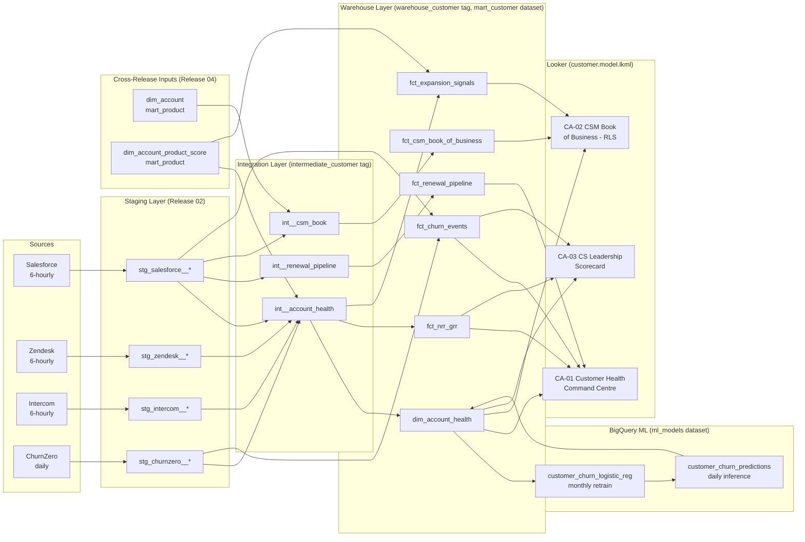

# Pipeline Architecture — Customer Analytics
## Release: 05-customer-analytics
## Core Dynamics Data Platform Modernisation

**Date**: 2026-03-25 | **Author**: Sophie Tanner, Rittman Analytics

---

## Overview

Release 05 extends the existing data pipeline with customer analytics phases. The pipeline draws on staging models already established in Release 02, cross-release outputs from Release 04 (dim_account, dim_account_product_score), and adds new integration and warehouse layers for customer health, churn prediction, and NRR/GRR.

The BigQuery ML training and inference jobs run as separate Cloud Composer tasks within the customer analytics phase, sequenced after the dbt customer warehouse models are built.

---

## Data Flow Diagram



---

## Source System Analysis

| Source | Technology | Schema Location | Volume | Availability | Sensitivity | Replication |
|--------|-----------|----------------|--------|-------------|-------------|-------------|
| Salesforce | SaaS CRM | `salesforce` (Fivetran) | 312 accts, 600 opps | 99.9% | High (ARR, contracts) | Incremental (Fivetran CDC) |
| Zendesk | SaaS Support | `zendesk` (Fivetran) | ~5K tickets/yr | 99.5% | Medium (CSAT scores) | Incremental (ticket updated_at) |
| Intercom | SaaS Comms | `intercom` (Fivetran) | NPS surveys: ~1K/yr | 99% | Medium (NPS responses) | Incremental (shared with R04) |
| ChurnZero | CS Platform | `churnzero` (Fivetran) | 14 months, 312 accts | 98% | Medium (usage signals) | Full refresh daily |
| dim_account | Release 04 output | `mart_product` | 312 rows | Same as R04 | Low | Cross-dataset reference |
| dim_account_product_score | Release 04 output | `mart_product` | 312×24 months | Same as R04 | Low | Cross-dataset reference |

---

## Staging Layer (Release 02 Outputs)

All staging models are already deployed as part of Release 02. This release consumes:

| Staging Model | Source | Key Fields Used |
|---------------|--------|----------------|
| `stg_salesforce__accounts` | Salesforce | account_pk, csm_owner, arr_usd, renewal_date, segment, region |
| `stg_salesforce__opportunities` | Salesforce | opportunity_pk, account_pk, type, stage, amount, close_date |
| `stg_salesforce__churn_events` | Salesforce closed-lost opps | account_pk, close_date, amount, churn_reason |
| `stg_zendesk__tickets` | Zendesk | ticket_pk, account_pk, created_at, resolved_at, status, csat_score, priority |
| `stg_intercom__nps_surveys` | Intercom | account_pk, survey_date, nps_score, response_text |
| `stg_churnzero__account_health` | ChurnZero | account_pk, health_date, churn_score, engagement_score, nps_score |

---

## Integration Layer (New — intermediate_customer tag)

| Model | Description | Materialisation |
|-------|-------------|----------------|
| `int__account_health` | Assembles 5 health signals per account per day from all sources + Release 04 product score | View |
| `int__renewal_pipeline` | Upcoming renewals with ARR, health score, CSM, days to renewal | View |
| `int__csm_book` | Per-CSM book of business: account list + health summary + action items | View |

---

## Warehouse Layer (New — mart_customer dataset)

| Model | Materialisation | Grain | Partition | Cluster | Notes |
|-------|----------------|-------|-----------|---------|-------|
| `dim_account_health` | Incremental | account × day | score_date | account_pk | Replaces ChurnZero as health score SoR |
| `fct_renewal_pipeline` | Full refresh | opportunity | close_date | csm_owner | 180-day lookahead window |
| `fct_csm_book_of_business` | Full refresh | account | — | csm_owner | Point-in-time snapshot daily |
| `fct_nrr_grr` | Full refresh | account × month | month_start | — | 24-month rolling; financial metrics |
| `fct_churn_events` | Incremental | churn event | event_date | account_pk | Deduped from SF + ChurnZero |
| `fct_expansion_signals` | Full refresh | account × signal | signal_date | account_pk | Deactivated when criteria no longer met |

---

## BigQuery ML Pipeline

### Model Training (monthly)
```
Cloud Composer Task: bqml_train_churn_model
  → CREATE OR REPLACE MODEL ml_models.customer_churn_logistic_reg
    OPTIONS (model_type='logistic_reg', input_label_cols=['is_churned'])
    AS SELECT ... FROM mart_customer.dim_account_health ...
```

### Daily Inference
```
Cloud Composer Task: bqml_predict_churn
  → CREATE OR REPLACE TABLE ml_models.customer_churn_predictions AS
    SELECT account_pk, predicted_is_churned_probs[OFFSET(1)].prob as churn_probability
    FROM ML.PREDICT(MODEL ml_models.customer_churn_logistic_reg, TABLE mart_customer.dim_account_health)
```

### Sequencing
BQML inference runs **after** `dim_account_health` is built, then results are joined back to `dim_account_health` view via a `customer_churn_predictions` reference.

---

## Cloud Composer DAG Extension

This release adds a customer analytics phase to the existing DAG:

```
Previous: [marketing phase] → [product phase] (parallel)
New:      [marketing phase] → [product phase] (parallel)
              ↓
          [customer phase] (sequential — depends on product score being ready)
              ├── run_intermediate_customer_models
              ├── run_warehouse_customer_models
              ├── bqml_train_churn_model (conditional: runs on 1st of month)
              └── bqml_predict_churn
```

The customer phase runs **after** the product phase to ensure `dim_account_product_score` is refreshed before the health score computation.

---

## Error Handling and Monitoring

| Error Scenario | Handling |
|---------------|---------|
| Salesforce Fivetran connector failure | Cloud Composer retries × 3; Slack alert to #data-platform-alerts |
| `int__account_health` build failure | Downstream tasks skipped; Looker shows "data as of [last_success]" |
| BQML inference failure | Retry × 3; fallback to previous day's predictions; alert sent |
| BQML training failure (monthly) | Alert to Sophie Tanner; previous model version used |
| NRR reconciliation assertion failure | Alert to #data-platform-alerts; David Park notified |
| dim_account_health row count drop >10% | Data quality alert; DQ-C01 assertion |

---

## Technology Stack

| Component | Technology | Version/Config |
|-----------|-----------|---------------|
| Data ingestion | Fivetran | Existing connectors (Release 02) |
| Staging | dbt (Release 02 outputs) | All existing |
| Integration + Warehouse | dbt Core | Version from Release 02 |
| Churn modelling | BigQuery ML | Logistic regression |
| Orchestration | Cloud Composer (Airflow 2.x) | Extends existing DAG |
| BI | Looker | Extends product.model.lkml |
| ML predictions store | BigQuery `ml_models` dataset | New dataset |
| Warehouse | BigQuery `mart_customer` dataset | New dataset |

---

## Security and Governance

- **ARR/NRR fields**: Exposed in Looker only to `finance_viewers` and `leadership` groups
- **CSM book RLS**: Looker `csm_owner` user attribute; each CSM sees only their assigned accounts
- **BQML dataset**: `ml_models` dataset restricted IAM — only dbt service account and data team
- **Churn probability**: Not exposed to CSMs directly; surfaced as risk band only (Low/Medium/High/Critical)
- **PII**: No individual user IDs; account_pk only (consistent with Releases 03/04)

---

## Key Design Decisions

| Decision | Choice | Rationale |
|----------|--------|-----------|
| BQML training data | 24 months with Salesforce proxy for months 15–24 | ChurnZero limited to 14 months; Salesforce contract events provide reasonable proxy |
| Health score frequency | Daily (not monthly) | CSM workflow requires daily visibility; product score monthly input averaged |
| BQML inference | Daily (model trained monthly) | Churn risk changes daily with new events; retraining monthly sufficient |
| NRR grain | Account × month | Enables cohort analysis, CSM attribution, and Finance reconciliation |
| Churn event source priority | Salesforce closed-lost > ChurnZero | Salesforce is financial system of record |
| Cross-dataset join | Use mart_product.dim_account_product_score directly | Avoids duplicating the model; BigQuery cross-dataset queries fast at 312-account scale |
