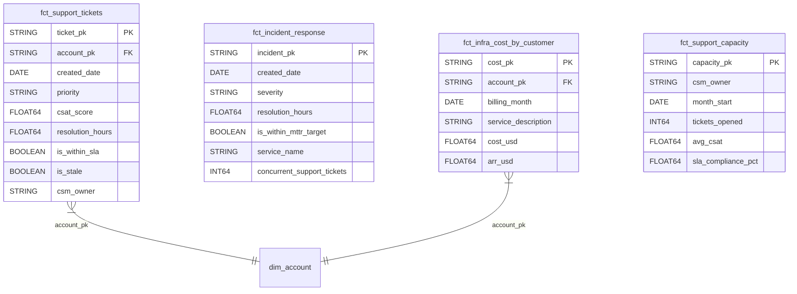

# Data Model Specification — Operational Analytics
## Release: 06-operational-analytics
## Core Dynamics Data Platform Modernisation

**Date**: 2026-03-25 | **Author**: Sophie Tanner, Rittman Analytics

---

## 1. dbt Project Variables

```yaml
# dbt_project.yml additions for release 06

vars:
  # Support SLA targets
  ops_p1_sla_hours: 4
  ops_p2_sla_hours: 24
  ops_p3_sla_hours: 72
  ops_p4_sla_hours: 168

  # Stale ticket threshold
  ops_stale_ticket_days: 7

  # Incident MTTR targets by severity
  ops_mttr_p1_target_hours: 2
  ops_mttr_p2_target_hours: 8

  # Cost attribution lookback
  ops_cost_lookback_months: 12
```

---

## 2. Staging Models (New)

### `stg_pagerduty__incidents.sql`
**Materialisation**: View
**Source**: pagerduty.incidents (Fivetran)

| Column | Type | Tests | Description |
|--------|------|-------|-------------|
| incident_pk | STRING | unique, not_null | SHA-256(incident_id) |
| incident_id | STRING | | PagerDuty incident ID |
| incident_number | INTEGER | | Human-readable incident number |
| title | STRING | | Incident title |
| severity | STRING | accepted_values(P1,P2,P3,P4) | Incident severity |
| status | STRING | accepted_values(resolved,acknowledged,triggered) | Current status |
| created_at | TIMESTAMP | | Incident created timestamp |
| resolved_at | TIMESTAMP | | Incident resolved timestamp |
| resolution_minutes | FLOAT64 | | resolved_at - created_at in minutes |
| service_id | STRING | | PagerDuty service ID |
| service_name | STRING | | Service display name |
| _fivetran_synced | TIMESTAMP | | Fivetran sync timestamp |

### `stg_gcp__billing_export.sql`
**Materialisation**: View
**Source**: gcp_billing.gcp_billing_export (BigQuery Billing Export)

| Column | Type | Tests | Description |
|--------|------|-------|-------------|
| billing_pk | STRING | unique, not_null | SHA-256(billing_date \|\| service_id \|\| sku_id) |
| billing_month | DATE | not_null | First day of billing month |
| service_description | STRING | | GCP service name (BigQuery, Cloud Composer, etc.) |
| sku_description | STRING | | SKU detail |
| cost_usd | FLOAT64 | | Cost in USD |
| usage_amount | FLOAT64 | | Usage quantity |
| usage_unit | STRING | | Usage unit (bytes, hours, etc.) |
| project_id | STRING | | GCP project ID |

---

## 3. Integration Models (New)

### `int__support_ops.sql`
**Materialisation**: View
**Tags**: intermediate_operations
**Description**: Support ticket operational view with SLA flags and CSM attribution.

Key joins: stg_zendesk__tickets → stg_salesforce__accounts (via account_pk)

### `int__incident_response.sql`
**Materialisation**: View
**Tags**: intermediate_operations
**Description**: PagerDuty incidents with MTTR calculation and weekly aggregation context.

### `int__infra_cost.sql`
**Materialisation**: View
**Tags**: intermediate_operations
**Description**: GCP billing cost attributed to customer accounts via proportional BigQuery usage.

---

## 4. Warehouse Models

### `fct_support_tickets.sql`
**Materialisation**: Incremental (partition by created_date)
**Unique Key**: ticket_pk
**Tags**: warehouse, warehouse_operations
**Dataset**: mart_operations

| Column | Type | Tests | Description |
|--------|------|-------|-------------|
| ticket_pk | STRING | unique, not_null | SHA-256(zendesk ticket_id) |
| account_pk | STRING | not_null, relationships | Account join key |
| created_date | DATE | not_null | Ticket creation date |
| resolved_date | DATE | | Resolution date (NULL if open) |
| priority | STRING | accepted_values(P1,P2,P3,P4) | Ticket priority |
| status | STRING | | Open/Pending/Solved/Closed |
| csat_score | FLOAT64 | | CSAT 1–5 scale |
| resolution_hours | FLOAT64 | | Hours from creation to resolution |
| sla_target_hours | FLOAT64 | | SLA target for this priority |
| is_within_sla | BOOLEAN | | Resolved within SLA target |
| is_stale | BOOLEAN | | Open >7 days without update |
| csm_owner | STRING | | CSM owner of the account |
| segment | STRING | | Account segment |
| ticket_category | STRING | | Zendesk ticket category/type |

### `fct_incident_response.sql`
**Materialisation**: Incremental (partition by created_date)
**Unique Key**: incident_pk
**Tags**: warehouse, warehouse_operations
**Dataset**: mart_operations

| Column | Type | Tests | Description |
|--------|------|-------|-------------|
| incident_pk | STRING | unique, not_null | SHA-256(pagerduty incident_id) |
| incident_number | INTEGER | not_null | Human-readable incident number |
| created_date | DATE | not_null | Incident creation date |
| resolved_date | DATE | | Resolution date |
| severity | STRING | accepted_values(P1,P2,P3,P4) | Severity |
| status | STRING | | Current status |
| resolution_hours | FLOAT64 | | Hours to resolve |
| is_within_mttr_target | BOOLEAN | | Resolved within MTTR target |
| service_name | STRING | | Affected service |
| incident_week | DATE | not_null | ISO week start date (for correlation) |
| concurrent_support_tickets | INT64 | | Open support tickets in same week |

### `fct_infra_cost_by_customer.sql`
**Materialisation**: Full refresh
**Tags**: warehouse, warehouse_operations
**Dataset**: mart_operations
**Note**: Financial — restricted to finance_viewers + leadership in Looker

| Column | Type | Tests | Description |
|--------|------|-------|-------------|
| cost_pk | STRING | unique, not_null | SHA-256(account_pk \|\| billing_month \|\| service) |
| account_pk | STRING | not_null, relationships | Account join key |
| billing_month | DATE | not_null | Billing month (first day) |
| service_description | STRING | not_null | GCP service name |
| cost_usd | FLOAT64 | | Attributed cost in USD |
| attribution_pct | FLOAT64 | | % of total cost attributed to this account |
| attribution_method | STRING | | Method: proportional_usage, direct_label |
| account_name | STRING | | Account display name |
| csm_owner | STRING | | CSM owner |
| segment | STRING | | Account segment |
| arr_usd | FLOAT64 | | Account ARR (for cost:ARR ratio) |

### `fct_support_capacity.sql`
**Materialisation**: Full refresh
**Tags**: warehouse, warehouse_operations
**Dataset**: mart_operations

| Column | Type | Tests | Description |
|--------|------|-------|-------------|
| capacity_pk | STRING | unique, not_null | SHA-256(csm_owner \|\| month_start) |
| csm_owner | STRING | not_null | CSM name |
| month_start | DATE | not_null | First day of month |
| tickets_opened | INT64 | | Tickets opened in month for this CSM's accounts |
| tickets_resolved | INT64 | | Tickets resolved in month |
| tickets_open_eom | INT64 | | Open tickets at end of month |
| avg_resolution_hours | FLOAT64 | | Average resolution time |
| avg_csat | FLOAT64 | | Average CSAT score |
| sla_compliance_pct | FLOAT64 | | % of tickets resolved within SLA |
| account_count | INT64 | | Number of accounts in CSM book |
| tickets_per_account | FLOAT64 | | Tickets opened / account count |

---

## 5. Physical ERD



---

## 6. Test Coverage Plan

| Model | PK Tests | FK Tests | Business Rule Tests |
|-------|----------|----------|---------------------|
| fct_support_tickets | unique + not_null(ticket_pk) | relationships(account_pk) | accepted_values(priority), accepted_values(status) |
| fct_incident_response | unique + not_null(incident_pk) | — | accepted_values(severity) |
| fct_infra_cost_by_customer | unique + not_null(cost_pk) | relationships(account_pk) | not_null(cost_usd), not_null(billing_month) |
| fct_support_capacity | unique + not_null(capacity_pk) | — | not_null(csm_owner), assert_sla_pct_in_range(0,100) |
